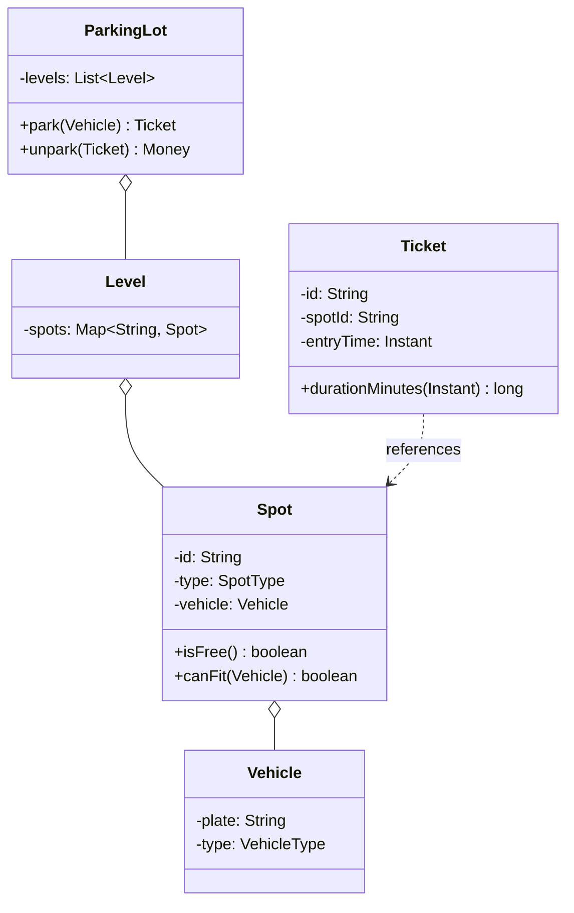

This is the "design a parking lot" question, the one that shows up so often people treat it as a warm-up and then fumble it anyway. I've asked it from both sides of the table. The trap is that it looks like a CRUD exercise, park a car, unpark a car, take some money, and candidates race to write a `ParkingService` with four methods and call it done. What the interviewer is actually probing is narrower than the whole lot and sharper: can you find the one algorithm that's going to change (the fee), put an interface exactly there, and can you let two threads fight over the last free spot without both of them winning. Nail those two and the rest is bookkeeping.

Let me walk it the way the [framework post](/interview/low-level-design/lld-framework/) says to: scope, entities and invariants, the variation axis, then a concurrency pass.

## The problem

Lock the scope out loud before you write anything. Three or four core operations, no more:

- **Park a vehicle**: find a free spot sized to the vehicle, claim it, issue a ticket.
- **Unpark a vehicle**: hand back the ticket, free the spot, compute the fee for the time parked.
- **Find a free spot**: the allocation step inside park, worth naming on its own because it's a second variation axis.

Explicitly out of scope, and say this: payments and gateways, license-plate OCR, reservations, multi-lot chains, and any HTTP or persistence. In-memory maps, a `Main` that runs the scenario, no controllers. The interviewer nods, you've shown you scope before you code.

## Entities and invariants

Nouns become classes. A `ParkingLot` owns one or more `Level`s, a `Level` owns its `Spot`s, a `Spot` may hold one `Vehicle`, and a `Ticket` records a parked vehicle against the spot it took and the time it arrived. Two enums carry the fixed-value adjectives: `VehicleType` (CAR, BIKE, TRUCK) and `SpotType` (COMPACT, REGULAR, LARGE). A vehicle fits a spot by size, that's the matching rule the allocator uses.

Now the part most people skip, the invariants, because they're what drive both your validation and your locks later:

- **A spot holds at most one vehicle.** This is the one the concurrency pass has to protect. Two cars in one spot is the bug the whole design exists to prevent.
- **A vehicle has at most one active ticket.** Park the same car twice without unparking and something is wrong, either a duplicate or a lost ticket.
- **A ticket's spot is occupied for exactly the ticket's lifetime.** Issue the ticket and the spot is taken, close the ticket and the spot frees, no window where the books disagree with reality.

Models carry behavior, not just getters. `Spot.canFit(vehicle)` knows its own sizing rule, `Ticket.durationMinutes(now)` computes its own elapsed time, `Spot.isFree()` answers for itself. Constructor injection everywhere, nothing does `new` on a strategy inside a service.



## The variation axis

The follow-up is coming and you already know its shape: "now charge more on weekends," "now add EV pricing," "now flat-rate for the first hour." The fee calculation is the thing most likely to change, so it goes behind a `FeeStrategy` interface, day one, before the interviewer even asks. That's the whole move from the [Strategy playbook](/interview/low-level-design/patterns/strategy-variation/): same question ("what does this park cost?"), different logic per policy, and the variation is a verb on the service, not the identity of a `Ticket`.

Keep the strategy pure, inputs in, decision out, no repositories inside it:

```java
// strategies/fee/FeeStrategy.java, interface gets the good name
public interface FeeStrategy {
    Money fee(Ticket ticket, Instant exit);   // pure: candidates in, decision out
}

// strategies/fee/HourlyFee.java, stateless: final fields only
public class HourlyFee implements FeeStrategy {
    private final Money ratePerHour;
    public HourlyFee(Money ratePerHour) { this.ratePerHour = ratePerHour; }
    @Override public Money fee(Ticket ticket, Instant exit) {
        long hours = (long) Math.ceil(ticket.durationMinutes(exit) / 60.0);
        return ratePerHour.times(hours);
    }
}

// strategies/fee/FlatFee.java
public class FlatFee implements FeeStrategy {
    private final Money flat;
    public FlatFee(Money flat) { this.flat = flat; }
    @Override public Money fee(Ticket ticket, Instant exit) { return flat; }
}
```

There's a second Strategy axis hiding in the allocation step, how you pick which free spot to hand out. Nearest-to-entrance, fill-lowest-level-first, spread-the-load, those are swappable too, so `SpotAllocationStrategy` is a legitimate second interface. Keep it separate from `FeeStrategy`, never merge them into one fat `ParkingStrategy`, or every new pricing variant would drag allocation along for the ride. Name both axes out loud, then only build the second one if you have time or the interviewer asks.

## Making it thread-safe

Now the explicit pass: "let me make this thread-safe." Restate the invariant that's actually at risk, a spot holds at most one vehicle, and find the smallest sequence that must be atomic. It's the classic check-then-act on a single key: read a spot's state (free?), then write it (claim it). Two threads both read "free," both write their own vehicle, and now two cars share a spot. Nothing threw, the books just quietly lie.

This is single-key, so you don't need to lock the whole level, you need atomicity per spot. Hold the spots in a `ConcurrentHashMap<String, Spot>` and do the claim inside `compute()` (or `putIfAbsent` on an occupancy map), which runs your check-and-set atomically for that one key:

```java
// pick-then-claim: allocation picks a free spot from a snapshot, the claim is atomic
Spot claim(Vehicle v) {
    while (true) {
        Spot pick = allocation.select(freeSnapshot(), v);   // may be stale
        if (pick == null) throw new NoSpotAvailableException(v.type());
        boolean won = spots.get(pick.id()).tryOccupy(v);     // atomic CAS on that spot
        if (won) return pick;
        // lost the race, someone claimed it first, re-pick
    }
}
```

The allocation strategy's pick can be stale, that's fine, but the claim cannot be. If you lost the race you drop that candidate and re-pick, you never lock the whole pool around the selection because that serializes the hottest path in the system. Narrate exactly that: "picking a spot is check-then-act on a single key, so `compute()` on the spot covers the invariant, and I re-pick on a lost claim instead of locking the level."

The lot itself is the textbook case for a Singleton. Every `Level`, `Spot`, and `Ticket` has to resolve against the same `ParkingLot` instance, two racing threads building two lots would each track a separate set of spots and the whole invariant story falls apart. In an interview I'd usually just instantiate it once in `Main` and inject it, and mention thread-safe lazy `getInstance()` only if the interviewer wants it.

## The takeaway

The parking lot rewards restraint. It's a small model with real behavior on it, one clear invariant to defend, and one algorithm you know is going to change. Get the spot-claim atomic, keep the fee behind an interface, and the design holds. To add surge pricing or EV rates or a free first hour, you write one new class implementing `FeeStrategy` and nothing else changes, that's the sentence you close the round on.

[← Back to Strategy Variation Playbook](/interview/low-level-design/patterns/strategy-variation)
