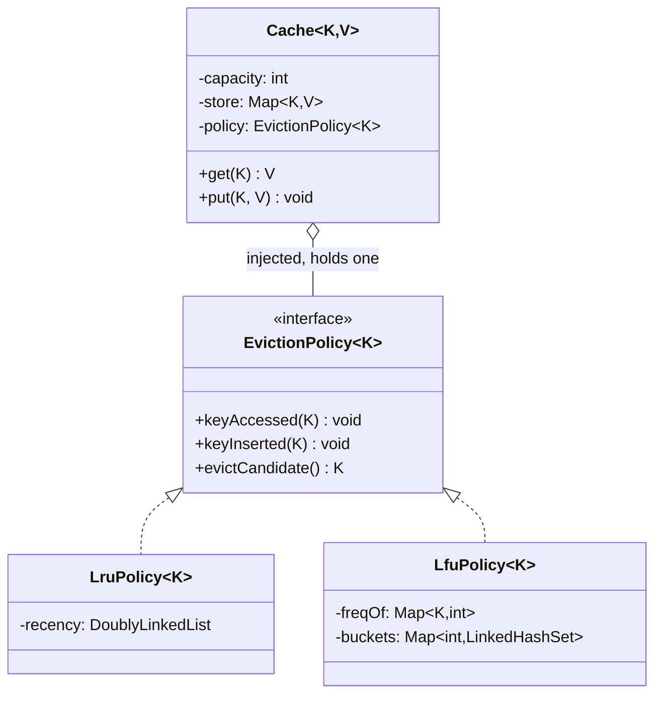

This is the follow-up the [LRU Cache](/interview/low-level-design/problems/lru-cache) question always turns into. You get the map-plus-doubly-linked-list right, you hit O(1) on both operations, the interviewer nods, and then it comes: "now make the eviction policy swappable, I want LFU, or FIFO, or MRU, without rewriting the cache." I've asked exactly this as the second half of the round, and it separates people cleanly. The trap is that it sounds like a Strategy problem, so candidates reach for the interface reflexively and drop it in the wrong place, usually letting the policy reach into the value store or letting the cache reason about recency. The real test is putting the `EvictionPolicy` interface at exactly the right seam so the policy and the store never touch each other's guts. Get the seam right and adding LFU is one new class. Get it wrong and every new policy drags the cache along with it.

I'll assume the LRU page did its job, so I won't re-derive the doubly linked list here, that's [over there](/interview/low-level-design/problems/lru-cache). Let me walk this one the way the [framework](/interview/low-level-design/lld-framework/) says: scope, entities and invariants, the variation axis (which is the whole problem this time), then a concurrency pass.

## The problem

Scope it out loud before writing anything. A fixed-capacity `Cache<K, V>` with two operations, and a policy chosen at construction:

- `get(key)`: returns the value if present, records the access so the policy can update its notion of "hotness," returns null (or throws) on a miss.
- `put(key, value)`: inserts or updates the key, records the insertion, and if the cache is now over capacity, asks the policy for exactly one victim and evicts it.
- The eviction policy is injected once, at construction. LRU, LFU, FIFO, MRU, the cache doesn't know or care which it holds.

Explicitly out of scope, and say this: TTL expiry, size-in-bytes accounting, runtime hot-swapping of the policy (that's a harder variant, I'll mention where it goes), persistence, and any HTTP or repository scaffolding. In-memory, constructor injection, a `Main` that runs the scenario. The point I'm making by scoping is that the design is small on purpose, the interest is entirely in where one interface sits.

## Entities and invariants

Two things own the world here, and keeping them apart is the entire design. The `Cache<K, V>` owns the K-to-V store and the capacity, nothing else. The `EvictionPolicy<K>` owns the metadata that decides who dies: recency for LRU, frequency for LFU, insertion order for FIFO. Notice the policy is parameterized by `K` only, it never sees a `V`. It doesn't need your values to decide who's coldest, and the moment it can see them the seam has leaked.

The invariants, because they drive both the eviction logic and the locks later:

- **size <= capacity, always.** After any `put` that overflows, the store holds exactly `capacity` entries, not one more.
- **On overflow, exactly one victim.** The policy names one key, the cache removes exactly that key from the store, no more and no less.
- **The store and the policy agree on the key set.** Every key in the store is tracked by the policy, and every key the policy tracks is in the store. Evict from the store but forget to tell the policy and you've got a ghost, the policy will eventually nominate a key that isn't there. This is the same map-and-list agreement invariant from the LRU page, lifted up a level: now it's store-and-policy.

Models carry behavior. The policy answers `evictCandidate()` for itself, the cache never inspects a linked list or a frequency bucket, it just asks. Constructor injection, no `new EvictionPolicy` inside the cache.



## The variation axis

This is the whole problem, so slow down here. The variation is "who gets evicted," it's a verb the cache delegates, not a property of any entry, and plausible answers differ in logic (recency vs frequency vs insertion order), not just in a number. That's the textbook Strategy trigger from the [playbook](/interview/low-level-design/patterns/strategy-variation/). And because the prompt itself names multiple variants (LFU, FIFO, MRU), the interface is day-one scope, not something you extract later. The LRU page told you to build the concrete thing first and extract on the second variant, that advice flips the moment the prompt hands you variant two up front.

The interface is three methods, each a hook the cache calls at a specific moment:

```java
// strategies/eviction/EvictionPolicy.java, the interface gets the good name
public interface EvictionPolicy<K> {
    void keyAccessed(K key);   // cache read a key, update hotness
    void keyInserted(K key);   // cache added a new key, start tracking it
    K evictCandidate();        // name the victim; caller removes it from the store
}
```

Three hooks, and the split between them is deliberate. `keyAccessed` and `keyInserted` are how the cache feeds the policy the events it needs, `evictCandidate` is the one question the cache asks back. The policy builds whatever private index it wants out of those events. That's the seam.

LRU is just the doubly linked list from the previous page, wrapped behind the interface. Access or insert moves the key to the head, the victim is always the tail:

```java
// strategies/eviction/LruPolicy.java
public class LruPolicy<K> implements EvictionPolicy<K> {
    // the exact map-plus-DLL from the LRU page, now private to the policy
    private final DoublyLinkedList<K> recency = new DoublyLinkedList<>();

    @Override public void keyAccessed(K key) { recency.moveToHead(key); }
    @Override public void keyInserted(K key) { recency.addToHead(key); }
    @Override public K evictCandidate()      { return recency.tailKey(); }  // least recent
}
```

LFU is a genuinely different index, and sketching it proves the interface holds. You track a count per key and bucket keys by count, so `evictCandidate` grabs from the smallest-frequency bucket (breaking ties by insertion order inside the bucket, which is what a `LinkedHashSet` buys you):

```java
// strategies/eviction/LfuPolicy.java, sketch
public class LfuPolicy<K> implements EvictionPolicy<K> {
    private final Map<K, Integer> freqOf = new HashMap<>();
    private final Map<Integer, LinkedHashSet<K>> buckets = new HashMap<>();
    private int minFreq = 0;

    @Override public void keyInserted(K key) {
        freqOf.put(key, 1);
        buckets.computeIfAbsent(1, f -> new LinkedHashSet<>()).add(key);
        minFreq = 1;
    }
    @Override public void keyAccessed(K key) {
        int f = freqOf.get(key);
        buckets.get(f).remove(key);
        if (buckets.get(f).isEmpty() && f == minFreq) minFreq++;
        freqOf.put(key, f + 1);
        buckets.computeIfAbsent(f + 1, x -> new LinkedHashSet<>()).add(key);
    }
    @Override public K evictCandidate() {
        K victim = buckets.get(minFreq).iterator().next();
        buckets.get(minFreq).remove(victim);
        freqOf.remove(victim);
        return victim;
    }
}
```

FIFO is even smaller, a plain queue where `keyAccessed` is a no-op (FIFO doesn't care that you touched it) and the victim is whatever's been in longest. MRU flips LRU to return the head instead of the tail. Four policies, four private indices, and here's the point to say out loud: the `Cache` class is byte-for-byte identical across all four. Adding LFU touches zero cache code.

And now the cache, which is almost boring, exactly as it should be:

```java
// Cache.java, knows a store and a policy, never which policy
public class Cache<K, V> {
    private final int capacity;
    private final Map<K, V> store = new HashMap<>();
    private final EvictionPolicy<K> policy;

    public Cache(int capacity, EvictionPolicy<K> policy) {
        if (capacity <= 0) throw new IllegalArgumentException("capacity must be positive");
        this.capacity = capacity;
        this.policy = policy;           // constructor injection, no new inside
    }

    public V get(K key) {
        if (!store.containsKey(key)) return null;
        policy.keyAccessed(key);        // the read is also a write, hold that thought
        return store.get(key);
    }

    public void put(K key, V value) {
        if (store.containsKey(key)) {
            store.put(key, value);
            policy.keyAccessed(key);    // update counts as an access, not a fresh insert
            return;
        }
        if (store.size() >= capacity) {
            K victim = policy.evictCandidate();
            store.remove(victim);       // both structures drop the same key, invariant held
        }
        store.put(key, value);
        policy.keyInserted(key);
    }
}
```

Now the why, because naming it is what earns the senior mark. Keeping the policy's metadata out of the value store is Single Responsibility made concrete: the cache's job is store-and-capacity, the policy's job is who-dies, and they change for different reasons. Nobody edits the `Cache` to ship a new eviction rule. That's Open/Closed falling out for free, the cache is closed for modification and the policy set is open for extension. The failure mode I watch for is a candidate stuffing a `frequency` field onto the value wrapper, or having the cache peek at a recency list. That collapses the two responsibilities into one class and every new policy now means surgery on the cache. The interface at this exact seam, cache calls three hooks and asks one question, is the entire answer to the round.

## Making it thread-safe

Explicit pass: "now let me make this thread-safe." Restate the invariant at risk, the store and the policy must agree on the key set, and find the smallest sequence that has to be atomic. A `put` that overflows does read-size, ask-for-victim, remove-victim, insert-new, update-policy, and if two threads interleave in there you'll evict twice, or blow past capacity, or leave the policy tracking a key the store already dropped.

Here's the gotcha, and it's the same one that bites the plain LRU cache, so I'll flag it and point back rather than re-argue it. `get()` is not a read. It calls `policy.keyAccessed`, which mutates the policy's private index (moves a node in LRU, shuffles frequency buckets in LFU). So a read is a write against shared state, which means a `ReadWriteLock` with concurrent readers corrupts the policy, two `get` calls relinking the same list nodes. This is the exact trap the [LRU page](/interview/low-level-design/problems/lru-cache) walks through in detail. The reasoning is identical, only now the mutated structure lives inside the policy instead of inside the cache.

So the smallest atomic boundary is the whole operation, and the same two honest answers apply. V1: a single `ReentrantLock` around `get` and `put`, correct and dead simple, serializes everything, and it's the right first move under time pressure. Say "this funnels every reader and writer through one lock." V2, if they push on throughput: shard into N segments, each its own store-plus-policy-plus-lock, route keys by `hash(key) % N`. Unrelated keys stop contending, and the honest caveat is that eviction is now per-shard, you evict the coldest within a shard, not globally, an approximation of true LRU or LFU. Naming which invariant you relaxed (global eviction order) and what you bought (throughput) is the whole point, and it's what real caches do anyway.

One extra note for this problem specifically: because the policy holds mutable state, it is now your concurrency problem, not a bystander. A stateless strategy could be shared lock-free across threads. This one can't, its mutability rides inside whatever lock guards the cache. Say that out loud, "the policy is stateful so it lives under the same lock as the store," and you've shown you understand why the earlier stateless strategies got away with no locking.

## The takeaway

The pluggable eviction cache is the LRU problem with the interface put in the one spot that matters. The store owns keys and values and capacity, the policy owns who-dies and nothing else, and the three-hook `EvictionPolicy` interface is the seam that keeps them from bleeding into each other. Get that split right and everything else follows: SRP because they change for different reasons, OCP because the cache never gets edited, and a concurrency story that's just the LRU one lifted a level. Adding a new eviction policy is a new `EvictionPolicy` class and a one-line change to the `Main` that wires it, the cache stays untouched. That's the sentence you close the round on.

[← Back to Strategy Variation Playbook](/interview/low-level-design/patterns/strategy-variation)
