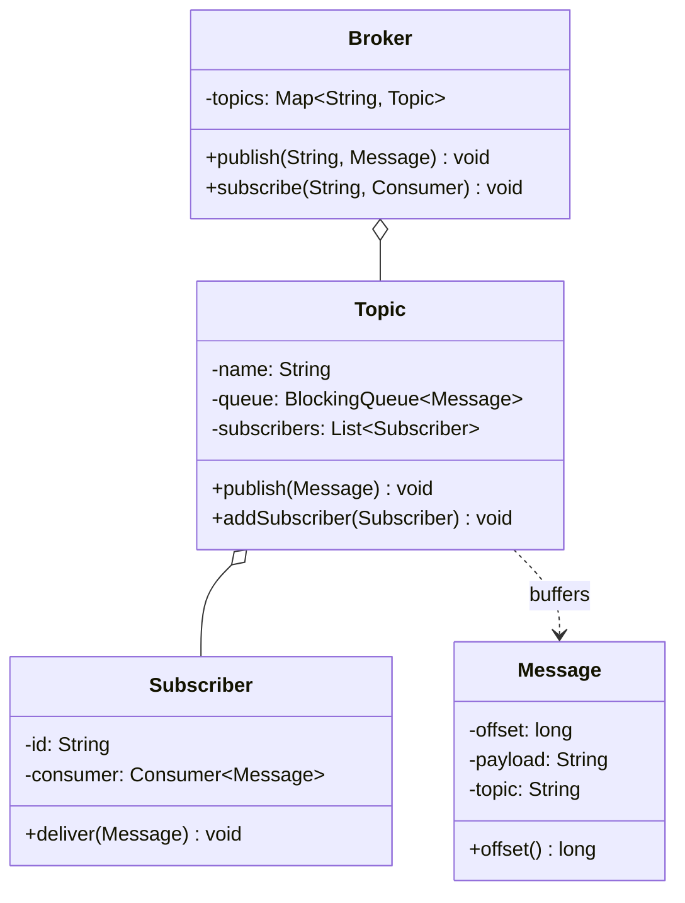

This is the "design an in-memory pub-sub, a message broker, basically Kafka-lite" question. It reads like plumbing, a producer drops a message, a subscriber picks it up, and candidates go straight for a `Map<String, List<Subscriber>>` and a `for` loop that calls each subscriber inline. That runs, technically, but it fails the actual test. The thing the interviewer is probing is whether you can decouple the producer from the consumer, so a slow subscriber doesn't stall the publisher, and whether you can keep messages inside a single topic in publish order once several threads are pushing at once. Get the decoupling boundary and the ordering guarantee right and the rest is a map and a thread.

I'll walk it the way the [framework post](/interview/low-level-design/lld-framework/) lays out: scope, entities and invariants, the variation axis, then a concurrency pass.

## The problem

Say the scope out loud before touching a keyboard. Three operations:

- **Publish**: `publish(topic, message)`, the producer hands a message to a topic and returns immediately, it does not wait for anyone to consume it.
- **Subscribe**: `subscribe(topic, consumer)`, a consumer registers interest in a topic and starts receiving messages published after it joined.
- **Deliver**: the broker fans a topic's messages out to every subscriber of that topic, at-least-once.

Explicitly out of scope, and name it: durable persistence (we lose everything on restart, that's fine), distributed partitions and replication, consumer groups with rebalancing, exactly-once semantics, and any HTTP or wire protocol. In-memory maps and queues, a `Main` that runs the scenario, no controllers. At-least-once is the delivery bar, so a message may be re-delivered on retry and consumers are expected to be idempotent, say that too because it changes the design.

## Entities and invariants

Nouns become classes. A `Broker` owns the topics and the wiring. A `Topic` owns its message buffer and the list of subscribers registered to it. A `Message` is an immutable payload with an offset, its position in the topic. A `Subscriber` wraps a `Consumer` callback, the code that actually handles a message. The relationship between a topic and its subscribers is the classic one-to-many, publish to the topic, every registered subscriber hears about it, which is Observer wearing a message-queue hat.

Now the invariants, because they drive both the fan-out and the locks:

- **A subscriber only receives messages for topics it subscribed to.** No cross-topic leakage. Subscribe to `orders` and you never see a `payments` message. This is what the per-topic routing exists to guarantee.
- **Within a single topic, one subscriber sees messages in publish order.** If the producer publishes A then B to `orders`, every subscriber of `orders` handles A before B. Note the scope: ordering is per topic, not global. Across two different topics there is no ordering promise, and interviewers like when you draw that line yourself.
- **A message published after a subscriber joins is delivered to it at least once.** At-least-once, so a redelivery on failure is allowed, a silent drop is not.

Models carry behavior, not just fields. `Topic.publish(message)` assigns the next offset and enqueues, `Topic.addSubscriber(sub)` registers under the topic's own concurrency discipline, `Message.offset()` answers for itself. Constructor injection throughout, nothing does `new` on a queue or a dispatcher inside business code.



## The design

The subscribe-and-fan-out relationship is Observer, straight out of the pattern table, "notify subscribers when a message arrives." But a naive Observer calls each subscriber inline on the publisher's thread, and that's the mistake, one slow consumer blocks the producer and every other consumer behind it. So we split the two halves with a queue. The producer publishes into a `BlockingQueue` on the topic and returns. A separate dispatcher thread drains that queue and fans each message out to the subscribers. That's producer-consumer decoupling bolted onto Observer, the publisher and the consumers never touch the same thread.

Here is the important claim to make out loud: the per-topic ordering guarantee comes from having a single consumer thread drain that topic's queue, not from locking. One dispatcher, one topic, pulls messages off the `BlockingQueue` in FIFO order and delivers them in that order. No lock on the topic buffer can give you ordering, only a single-threaded drain can, because the moment two threads dequeue concurrently the order they deliver in is a coin flip.

```java
// models/Topic.java, owns its buffer and its subscribers
public class Topic {
    private final String name;
    private final BlockingQueue<Message> queue = new ArrayBlockingQueue<>(1000);
    private final List<Subscriber> subscribers = new CopyOnWriteArrayList<>();
    private final AtomicLong nextOffset = new AtomicLong(0);

    public Topic(String name) { this.name = name; }

    public void publish(String payload) throws InterruptedException {
        long offset = nextOffset.getAndIncrement();
        queue.put(new Message(offset, payload, name));   // blocks if full: back-pressure
    }
    public void addSubscriber(Subscriber s) { subscribers.add(s); }
    Message take() throws InterruptedException { return queue.take(); }  // dispatcher only
    List<Subscriber> subscribers() { return subscribers; }
}
```

```java
// services/Broker.java, wiring plus one dispatcher thread per topic
public class Broker {
    private final Map<String, Topic> topics = new ConcurrentHashMap<>();
    private final ExecutorService dispatchers = Executors.newCachedThreadPool();

    public void publish(String topicName, String payload) throws InterruptedException {
        topics.computeIfAbsent(topicName, this::startTopic).publish(payload);
    }
    public void subscribe(String topicName, Consumer<Message> consumer) {
        topics.computeIfAbsent(topicName, this::startTopic)
              .addSubscriber(new Subscriber(consumer));
    }
    private Topic startTopic(String name) {
        Topic topic = new Topic(name);
        dispatchers.submit(() -> drain(topic));   // the single consumer for this topic
        return topic;
    }
    private void drain(Topic topic) {
        try {
            while (!Thread.currentThread().isInterrupted()) {
                Message msg = topic.take();               // FIFO, ordering lives here
                for (Subscriber s : topic.subscribers()) {
                    s.deliver(msg);                       // at-least-once per subscriber
                }
            }
        } catch (InterruptedException e) { Thread.currentThread().interrupt(); }
    }
}
```

That's the working spine. The Command-flavored extension to mention, since we're coming from the [Command playbook](/interview/low-level-design/patterns/command-variation/), is offsets and replay. Right now the message is dropped after delivery. If instead the topic keeps an append-only log of messages, indexed by offset, a subscriber can track its own read position and re-read from any offset, which is exactly the "the log of operations IS the source of truth, state equals fold over the log" idea. That's how the real Kafka works, and it's the natural follow-up: swap the transient drain for a persistent offset cursor per subscriber. Name it, build it only if there's time.

## Making it thread-safe

Now the explicit pass: "let me make this thread-safe." Three shared things get touched concurrently, and each has a different right answer, so I walk them one at a time.

**Producers publishing into a topic.** Many producer threads call `publish` on the same topic at once. The `BlockingQueue` is the correct primitive straight off the framework's concurrency menu, this is textbook producer-consumer, and an `ArrayBlockingQueue` is thread-safe by design, concurrent `put`s are serialized internally with no lock of mine. It also gives back-pressure for free: bound the queue, and when it fills a `put` blocks the producer instead of letting the buffer grow without limit and eat the heap. That back-pressure is a feature, not a bug, and it's worth saying out loud that I chose a bounded queue on purpose. Offsets come from an `AtomicLong`, so two concurrent publishers never collide on the same position.

**Updating the subscriber set.** A thread calling `subscribe` while the dispatcher is mid-fan-out is a classic read-during-write. Topics live in a `ConcurrentHashMap`, and `computeIfAbsent` makes topic creation atomic, so two threads racing to publish to a brand-new topic get one topic and one dispatcher, not two. The subscriber list itself is a `CopyOnWriteArrayList`, because the read pattern is lopsided: the dispatcher iterates it on every single message, subscribers get added rarely. Copy-on-write means the dispatcher iterates a stable snapshot with zero locking on the hot path, and a new subscriber just swaps in a fresh array. Reach for it precisely because reads dwarf writes here.

**Per-topic ordering.** This is the one people try to solve with a lock and get wrong. Ordering is not a locking problem, it's a single-consumer problem. One dispatcher thread per topic drains that topic's queue, so messages leave the queue in FIFO order and get delivered in that order, by construction. No lock gives you that. If I ran two dispatchers on one topic for throughput, I'd have thrown ordering away. So the design is one consumer per topic, and if a topic gets hot the scaling answer is partitions within the topic, each partition its own single consumer, ordering held per partition, which is again exactly Kafka's model.

One honest caveat under at-least-once: if a subscriber's `deliver` throws and I retry it, that subscriber may see the same message twice, which is why the contract says consumers must be idempotent. I would not reach for locks to fix that, it's a semantics choice, not a race.

## The takeaway

The pub-sub round is small once you see the two real moves. Put a `BlockingQueue` between producer and consumer so a slow subscriber can't stall the publisher, and pin one consumer thread per topic so ordering falls out of the drain instead of out of a lock. Observer gives you the fan-out shape, producer-consumer gives you the decoupling, and the concurrency answer is mostly picking the right primitive rather than sprinkling `synchronized`. To add durable replay you keep an append-only log per topic and hand each subscriber an offset cursor, to scale a hot topic you split it into partitions each with its own single consumer, and neither change touches the publish path. That's the sentence to close on.

[← Back to Command Variation Playbook](/interview/low-level-design/patterns/command-variation)
