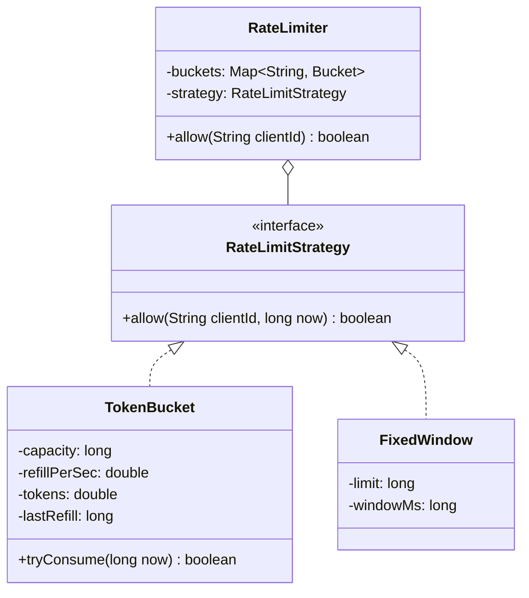

This is the "design a rate limiter" question, and it fools people because the API is one method. `allow(clientId)` returns true or false, that's it, and candidates who see a one-method interface relax right into a trap. There are two real tests buried in here and neither of them is the method signature. The first is picking the algorithm, token bucket versus sliding window versus fixed window, and being able to say out loud why you'd choose one. The second is the concurrency, because the whole point of a rate limiter is a lot of threads hammering the same client's state at once, and if your check-and-decrement isn't atomic you'll happily let a client through over its quota and never throw a thing. Get the algorithm choice articulate and get that one atomic per key, and you're done.

Let me walk it the way the [framework post](/interview/low-level-design/lld-framework/) lays out: scope, entities and invariants, the variation axis, then the concurrency pass.

## The problem

Say the scope before you write a line. The core operation is tiny:

- **`allow(clientId)`**: returns true if this request is within the client's quota, false if the client should be throttled. A client is capped at N requests per window.

That's the whole surface. What you clarify next is what makes you look senior:

- **Per client, or global?** Per client (per API key, per IP), each `clientId` gets its own independent budget. Say it, because it decides your storage shape immediately, a map keyed by client.
- **What are N and the window?** Fix them for the demo, say 5 requests per second, and note they'd come from config or per-tier in real life.

Explicitly out of scope, and name it: this is a single-process, in-memory limiter. The real-world version is distributed, the counters live in Redis and the check-and-decrement becomes a Lua script or an atomic `INCR` with expiry so every app server sees the same budget. I'll mention that as the extension at the end, but I'm not building a network hop today. No controllers, no HTTP, a `Main` that runs the scenario.

## Entities and invariants

The nouns are thin here, which is fine. A `RateLimiter` is the service, it owns a map of per-client state. The per-client state is a `Bucket` (token bucket) or a counter, depending on the algorithm, and that's the object your concurrency has to protect. There's no `Ticket`, no lifecycle, this is closer to a cache than to the parking lot.

The invariant is the whole game, and it's one line:

- **A client never gets more than N allowed requests within its window.** Every `allow` that returns true consumes exactly one unit of budget, and budget refills or resets by the algorithm's rules, never faster. Two threads both reading "1 token left" and both returning true is the bug the entire design exists to stop, same shape as two cars in one parking spot.

Models carry behavior. A `TokenBucket` refills and consumes itself, it doesn't hand out its innards for the service to poke at. Constructor injection everywhere, and the clock gets injected too, because a rate limiter that reads `System.currentTimeMillis()` internally is untestable, you can't prove the refill works without waiting real seconds. Inject the clock, pass a fake one in `Main`, and the demo is deterministic.

Here's the token bucket, the mental model most people reach for. A bucket holds up to `capacity` tokens, tokens drip back in at `refillRate` per second, each allowed request removes one token, and an empty bucket means throttled.



## The variation axis

The follow-up here is a certainty, and its shape is "use a different algorithm." Interviewers love this one precisely because there are four textbook algorithms with different tradeoffs, and swapping between them is exactly the Open/Closed test. So the algorithm goes behind a `RateLimitStrategy` interface on day one. Same question every time ("is this request allowed?"), different logic per algorithm, that's the move straight out of the [Strategy playbook](/interview/low-level-design/patterns/strategy-variation/).

The interface takes the client and the current time, and owns the per-client state internally (the strategy holds the map of buckets, because the state shape is algorithm-specific, a token count for the bucket, a windowed counter for fixed window):

```java
// strategies/RateLimitStrategy.java, interface gets the good name
public interface RateLimitStrategy {
    boolean allow(String clientId, long now);   // now injected so tests are deterministic
}
```

Token bucket, with lazy refill. The trick worth knowing: you don't run a background thread topping up every bucket every tick, that's a thread per client and a scheduling mess. You refill lazily, on access. When a request comes in you compute how many tokens should have dripped in since `lastRefill`, add them (capped at capacity), then try to take one. No timer, the math does the refilling.

```java
// strategies/TokenBucketStrategy.java
public class TokenBucketStrategy implements RateLimitStrategy {
    private final long capacity;
    private final double refillPerSec;
    private final ConcurrentHashMap<String, TokenBucket> buckets = new ConcurrentHashMap<>();

    public TokenBucketStrategy(long capacity, double refillPerSec) {
        this.capacity = capacity;
        this.refillPerSec = refillPerSec;
    }

    @Override public boolean allow(String clientId, long now) {
        TokenBucket b = buckets.computeIfAbsent(clientId,
                k -> new TokenBucket(capacity, refillPerSec, now));
        return b.tryConsume(now);   // synchronized inside, see concurrency pass
    }
}

// models/TokenBucket.java, behavior lives on the model
public class TokenBucket {
    private final long capacity;
    private final double refillPerSec;
    private double tokens;
    private long lastRefill;   // millis

    public TokenBucket(long capacity, double refillPerSec, long now) {
        this.capacity = capacity;
        this.refillPerSec = refillPerSec;
        this.tokens = capacity;   // start full
        this.lastRefill = now;
    }

    public synchronized boolean tryConsume(long now) {
        refill(now);
        if (tokens >= 1.0) { tokens -= 1.0; return true; }
        return false;
    }

    private void refill(long now) {
        double elapsedSec = (now - lastRefill) / 1000.0;
        tokens = Math.min(capacity, tokens + elapsedSec * refillPerSec);
        lastRefill = now;
    }
}
```

And a short fixed-window counter, so you can talk about the tradeoff. Divide time into fixed buckets (each second, say), keep a count per client per window, reset when the window rolls over:

```java
// strategies/FixedWindowStrategy.java
public class FixedWindowStrategy implements RateLimitStrategy {
    private final long limit;
    private final long windowMs;
    private final ConcurrentHashMap<String, Window> windows = new ConcurrentHashMap<>();

    public FixedWindowStrategy(long limit, long windowMs) {
        this.limit = limit;
        this.windowMs = windowMs;
    }

    @Override public boolean allow(String clientId, long now) {
        Window w = windows.computeIfAbsent(clientId, k -> new Window());
        return w.tryAllow(now / windowMs, limit);   // windowId = now / windowMs
    }

    static class Window {
        private long windowId = -1;
        private long count = 0;
        synchronized boolean tryAllow(long id, long limit) {
            if (id != windowId) { windowId = id; count = 0; }  // rolled over, reset
            if (count < limit) { count++; return true; }
            return false;
        }
    }
}
```

Now the tradeoff, say it out loud. Fixed window is cheap, one counter and a compare, but it has a boundary burst problem: a client can fire N requests in the last moment of one window and N more in the first moment of the next, so 2N in a hair over the window boundary, which violates the spirit of the limit. Sliding-window log fixes that by keeping the actual timestamps of recent requests and counting only those inside a rolling window, exact but memory-hungry, you store a timestamp per request. Token bucket sits in between: it smooths bursts naturally (you can burst up to `capacity` then you're rate-limited to the refill rate) and it's O(1) memory per client, which is why it's the usual default. Name which one you'd ship and why, that's the actual thing being graded.

## Making it thread-safe

Now the explicit pass, "let me make this thread-safe." Restate the at-risk invariant: a client never gets more than N allowed in its window. Find the smallest sequence that must be atomic, and it's a textbook check-then-act on a single key. Read the bucket's token count (is there at least one?), then write it (decrement). Two threads both read "1.0 tokens," both see `>= 1.0`, both decrement, both return true, and now the client got two requests on a one-token budget. Nothing threw. The counter just quietly went negative, or worse, you clamped it and lost track.

The important thing to narrate: `ConcurrentHashMap` alone does not save you here. Putting the buckets in a `ConcurrentHashMap` makes `computeIfAbsent` safe so two threads racing on a brand-new client don't create two buckets, good, that's necessary. But once both threads have a reference to the *same* bucket, the `refill`-then-check-then-decrement across three lines is a compound operation on that bucket's fields, and the map's thread-safety does nothing for it. A plain get-then-mutate races on the object the map handed back.

This is single-key, so you don't lock the whole limiter, you make the operation atomic per bucket. Two clean ways.

The first, which is what the code above does, is `synchronized` on `tryConsume` inside the `TokenBucket` itself. The whole refill-check-decrement runs under the bucket's own monitor, so it's atomic per bucket and different clients never contend with each other (different objects, different locks). Simple, correct, and the contention is per-client which is exactly the granularity you want. Say that: "the bucket guards its own read-modify-write, so contention is per client, not global."

The second, if the interviewer pushes on lock-free, is to do the whole thing inside the map's `compute()`:

```java
@Override public boolean allow(String clientId, long now) {
    boolean[] allowed = {false};
    buckets.compute(clientId, (k, b) -> {
        if (b == null) b = new TokenBucket(capacity, refillPerSec, now);
        allowed[0] = b.tryConsume(now);   // runs atomically for this key
        return b;
    });
    return allowed[0];
}
```

`compute()` holds the bin lock for that one key while the remapping function runs, so the check-and-decrement is atomic for that client and, again, other clients are untouched. Whichever you pick, the sentence is the same: "claiming a token is check-then-act on a single key, so I make the read-modify-write atomic per bucket, either a `synchronized` method on the bucket or `compute()` on the map, and I never lock across clients." If the token count were a pure counter with no refill math you could even reach for an `AtomicLong` and a CAS loop, but the refill makes it a multi-field update, so the per-key lock is the honest fit.

## The takeaway

The rate limiter is deceptively small, one method, one invariant, and the two things it's actually testing are both easy to fumble. Pick an algorithm you can defend (token bucket for the burst-smoothing and O(1) memory, and know why fixed window's boundary burst is a real problem), and get the check-and-decrement atomic per client so two threads can't both spend the last token. To add a new algorithm, sliding window log, leaky bucket, you write one new class implementing `RateLimitStrategy` and nothing else moves. And when they ask "now make it work across ten servers," you already have the answer waiting: same interface, but the state moves to Redis and the atomic step becomes an `INCR` with expiry or a Lua script, so the budget is shared instead of per-process. That's the sentence you close on.

[← Back to Strategy Variation Playbook](/interview/low-level-design/patterns/strategy-variation)
