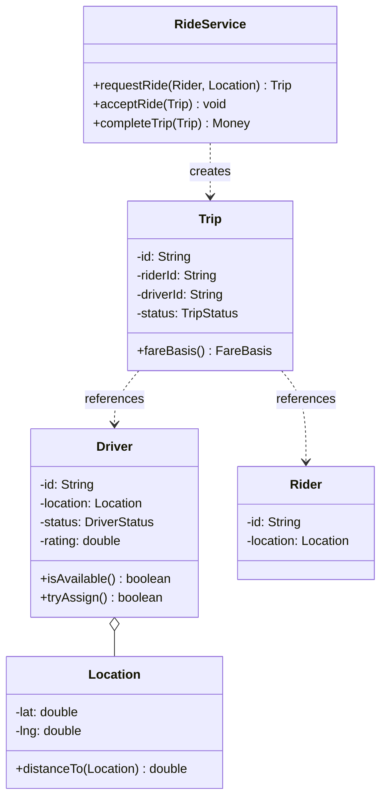

This is the "design Uber" question, and the first thing you have to do is figure out which Uber they mean. The [framework post](/interview/low-level-design/lld-framework/) draws the line: in system design you sketch a matching service, a pricing service, a location service, a queue, and argue about how they scale. That's boxes and arrows. In LLD they want the `Trip` class, the `TripStatus` enum, and how `requestRide()` and `completeTrip()` actually behave under two threads. Same prompt, completely different interview. Confirm which one before you write a line, because the losing move is whiteboarding Kafka partitions when the interviewer wanted a driver-matching algorithm.

Assuming it's the LLD, the exercise looks like CRUD again, request a ride, assign a driver, end the trip, take money, and candidates reach for a `RideService` with five methods. What's actually being probed is two things: can you find the algorithm that's going to change (driver matching) and put an interface exactly there, and can you stop two riders from both being assigned the same driver. Everything else is bookkeeping.

Let me walk it the framework's way: scope, entities and invariants, the variation axis, then a concurrency pass.

## The problem

Lock the scope out loud before writing anything. A handful of core operations, no more:

- **Request a ride**: a rider at a location asks for a car, the system matches a nearby available driver and creates a trip in a pending state.
- **Accept the ride**: the matched driver confirms, the trip moves to ongoing.
- **Complete the trip**: the driver ends it, the system computes the fare and frees the driver.

Explicitly out of scope, and say this: real-time GPS streaming, maps and routing, payments and gateways, driver onboarding, ratings persistence, cancellations-with-refunds, and any HTTP or database. In-memory maps, a `Main` that runs the scenario, no controllers. You've shown you scope before you code.

## Entities and invariants

Nouns become classes. A `Rider` requests trips, a `Driver` has a current `Location` and a status, a `Trip` ties one rider to one driver with a fare, and `Location` is a plain value with a `distanceTo(other)`. Two enums carry the lifecycle: `DriverStatus` (AVAILABLE, ASSIGNED) and `TripStatus` (REQUESTED, MATCHED, ONGOING, COMPLETED). A driver is a matching candidate only while AVAILABLE.

Now the invariants, because they drive both your validation and your locks later:

- **A driver has at most one active trip.** This is the one the concurrency pass has to protect. Two trips on one driver is the bug the whole design exists to prevent.
- **A trip has exactly one driver.** Once matched, that trip owns that driver for its lifetime, no reassignment mid-ride, no second driver sneaking in.
- **A trip's driver is ASSIGNED for exactly the trip's active lifetime.** Match the trip and the driver flips to ASSIGNED, complete the trip and the driver flips back to AVAILABLE, no window where a driver is on a trip but still shows up in the free pool.

Models carry behavior, not just getters. `Location.distanceTo(other)` knows its own geometry, `Driver.isAvailable()` answers for itself, `Trip.fareBasis()` exposes the distance and duration a pricing strategy needs. Constructor injection everywhere, nothing does `new` on a strategy inside the service.



## The variation axis

The follow-up is coming and you know its shape: "now match on rating, not just distance," "now prefer drivers heading the rider's way," "now surge on demand." Driver matching is the thing most likely to change, so it goes behind a `DriverMatchingStrategy` interface, day one, before the interviewer asks. Same question ("which driver?"), different logic per policy, and the variation is a verb on the service, not the identity of a `Driver`.

Keep the strategy pure, candidates in, decision out, no repositories inside it:

```java
// strategies/matching/DriverMatchingStrategy.java, interface gets the good name
public interface DriverMatchingStrategy {
    Optional<Driver> pick(List<Driver> available, Location riderLoc);  // pure
}

// strategies/matching/NearestDriverStrategy.java
public class NearestDriverStrategy implements DriverMatchingStrategy {
    @Override public Optional<Driver> pick(List<Driver> available, Location riderLoc) {
        return available.stream()
                .min(Comparator.comparingDouble(d -> d.location().distanceTo(riderLoc)));
    }
}
```

The second variant is where the [Strategy playbook](/interview/low-level-design/patterns/strategy-variation/) comparator cascade earns its keep. "Prefer the nearest, but break ties by rating" is not a new algorithm, it's one more `Comparator` composed onto the first:

```java
// strategies/matching/NearestThenRatedStrategy.java, comparator cascade
public class NearestThenRatedStrategy implements DriverMatchingStrategy {
    @Override public Optional<Driver> pick(List<Driver> available, Location riderLoc) {
        Comparator<Driver> cascade =
                Comparator.comparingDouble((Driver d) -> d.location().distanceTo(riderLoc))
                          .thenComparing(Comparator.comparingDouble(Driver::rating).reversed());
        return available.stream().min(cascade);
    }
}
```

Name it out loud: "this is a comparator cascade, distance then rating, not a fresh algorithm." There's a second, independent Strategy axis in pricing, a `PricingStrategy` with `BasePricing` and `SurgePricing`, because "what does this trip cost?" varies per policy exactly the way matching does. Keep the two interfaces separate, never merge them into one fat `RideStrategy`, or every new surge rule would drag matching along for the ride. And there's an Observer axis worth naming even if you don't build it: rider and driver both want to hear about status changes (matched, driver arriving, completed), so the `Trip` publishes lifecycle events and notifiers subscribe. Name all three axes, build matching, mention the rest.

## Making it thread-safe

Now the explicit pass: "let me make this thread-safe." Restate the invariant that's at risk, a driver has at most one active trip, and find the smallest sequence that must be atomic. Matching is check-then-act across two steps that are easy to split: the strategy reads the pool of available drivers and picks one, then the service assigns that driver. Two riders request at the same instant, both snapshots show driver D free, both pick D, both assign, and now D has two trips. Nothing threw, the books just quietly lie. This is the same shape as the parking-lot spot claim.

The fix is pick-then-claim. The strategy's pick runs against a stale snapshot, that's fine, but the claim has to be atomic on the single driver. Hold drivers in a `ConcurrentHashMap<String, Driver>` and make the flip from AVAILABLE to ASSIGNED atomic per driver, `compute()` on that one key, or a CAS on the driver's status. If the flip fails because someone already claimed the driver, drop that candidate and re-pick:

```java
// pick-then-claim: matching picks from a snapshot, the claim is atomic per driver
Driver claim(Location riderLoc) {
    while (true) {
        Optional<Driver> pick = matching.pick(availableSnapshot(), riderLoc);  // may be stale
        if (pick.isEmpty()) throw new NoDriverAvailableException(riderLoc);
        Driver d = pick.get();
        boolean won = drivers.get(d.id()).tryAssign();   // atomic AVAILABLE -> ASSIGNED
        if (won) return d;
        // lost the race, someone claimed this driver first, re-pick without them
    }
}
```

`tryAssign()` lives on the `Driver` and does the atomic compare-and-set: only flip to ASSIGNED if currently AVAILABLE, return whether this thread won. Narrate exactly that: "picking a driver is check-then-act on a single key, so the atomic status flip on the driver covers the invariant, and I re-pick on a lost claim instead of locking the whole driver pool." You never lock the pool around the selection, that serializes the hottest path in the system, and matching is the hottest path there is.

The reverse operation matters too. `completeTrip()` flips the driver back to AVAILABLE, and that flip has to be the same atomic write, so a driver freed by one thread is instantly a candidate for another with no lost update. Same key, same primitive.

## The takeaway

Ride sharing rewards the same restraint the parking lot does. It's a small model with real behavior, one invariant that actually bites (one active trip per driver), and one algorithm you know will change (matching). Get the driver-claim atomic, keep matching and pricing behind separate interfaces, and the design holds under load. To add rating-weighted matching or surge pricing or ETA-based dispatch, you write one new class implementing the relevant strategy interface and nothing else changes, that's the sentence you close the round on.

[← Back to Strategy Variation Playbook](/interview/low-level-design/patterns/strategy-variation)
