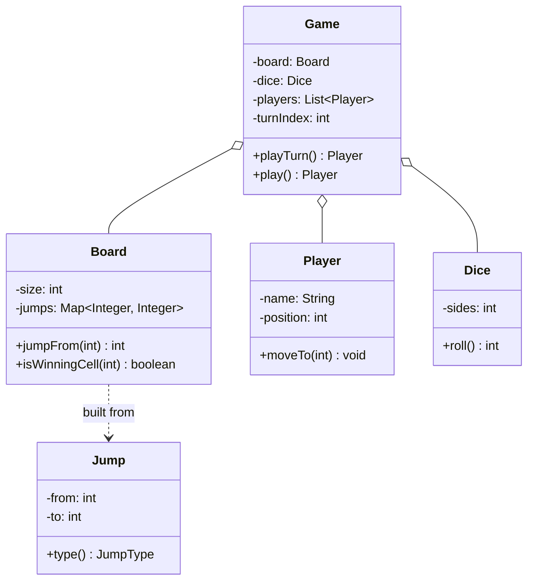

This is the "design Snake and Ladder" question, and it's a trap dressed up as a warm-up. It looks like a childhood board game, so candidates relax, and then they walk straight into the pit: they start writing `if (cell == 17) player.position = 7; else if (cell == 62) ...` and by the time they've hard-coded the fourth snake the interviewer already knows how this ends. I've watched it happen from the other chair. The real thing being probed here is whether you can see that the snakes and the ladders aren't logic at all, they're a lookup table, and the move algorithm is exactly the same whether the board has three ladders or thirty. There's no clever pattern to reach for. The clever move is recognizing there's nothing clever to reach for.

Let me walk it the way the [framework post](/interview/low-level-design/lld-framework/) says to: scope, entities and invariants, the variation axis, then a concurrency pass.

## The problem

Lock the scope out loud before you write anything. A handful of operations, no more:

- **Roll the dice**: produce a number, 1 to 6, for the player whose turn it is.
- **Move a player**: advance their position by the roll, then, if they landed on the start of a jump, teleport them to its destination.
- **Run the turn loop**: cycle through N players in order, one roll each, until someone lands exactly on 100 and wins.

Explicitly out of scope, and say this: multiple dice or biased dice unless asked, the "roll again on a six" house rule, "must land exactly on 100 or you bounce back" unless the interviewer wants it, persistence, networking, any HTTP. In-memory objects, a `Main` that plays the game to completion, no controllers. Two players and a standard 100-cell board is the scenario I'll demo.

## Entities and invariants

Nouns become classes. A `Board` owns 100 `Cell`s and, more importantly, owns the jump table. A `Jump` is a snake or a ladder, both are the same shape, a `from` cell and a `to` cell, the only difference is direction. A `Player` has a name and a current position. A `Dice` produces a roll. A `Game` holds the board, the players, and the turn cursor, and it runs the loop. One enum, `JumpType` (SNAKE, LADDER), and honestly you barely need it, the sign of `to - from` already tells you which it is, but the enum reads well and validates cleanly.

Now the part most people skip, the invariants, because they're what keep your data honest and your validation cheap:

- **A cell is the start of at most one jump.** You can't have a ladder and a snake both leaving cell 17, the move would be ambiguous. This is the invariant your board loader checks at construction.
- **A ladder goes up, a snake goes down.** `LADDER` means `to > from`, `SNAKE` means `to < from`. A "ladder" that sends you backward is a corrupt board, catch it at load time, not mid-game.
- **A player's position stays in [0, 100].** Start at 0, never exceed 100. A roll that would overshoot 100 is a no-move (the standard rule), so the position is always a legal cell.

Models carry behavior, not just getters. `Board.jumpFrom(position)` answers whether a cell teleports you and where. `Player.moveTo(cell)` updates position and knows its own bounds. `Dice.roll()` owns the randomness. Constructor injection everywhere, the `Game` gets its `Board`, `Dice`, and players handed in, it never news up its own dice.



## Why this is a data-driven problem

Here's the whole game, and I mean that literally. The snakes and the ladders are a single `Map<Integer, Integer>`, cell to destination. A snake's key maps to a smaller value, a ladder's key maps to a bigger one, and the move code does not care which. It looks the entry up, and if it's there, it jumps. That's it. Adding a snake from 99 to 4 is one new map entry. Zero code change. That's the [data-driven pattern](/interview/low-level-design/patterns/data-driven-variation/) in its purest form, rung 2 on the spectrum: a `Map` table seeded in `Main`, narrated as "in production this loads from a board file, the shape is identical, only the source changes."

```java
// models/Board.java, the jumps ARE the data, not code
public final class Board {
    private final int size;                     // 100
    private final Map<Integer, Integer> jumps;  // from -> to, snakes and ladders both

    public Board(int size, Map<Integer, Integer> jumps) {
        // validate at construction, fail fast on a corrupt board
        for (var e : jumps.entrySet()) {
            int from = e.getKey(), to = e.getValue();
            if (from < 1 || from > size || to < 1 || to > size)
                throw new InvalidBoardException("jump out of range: " + from + "->" + to);
            if (from == to)
                throw new InvalidBoardException("jump to self at " + from);
        }
        this.size = size;
        this.jumps = Map.copyOf(jumps);         // immutable after load
    }

    // returns the destination if this cell jumps, else the cell itself
    public int jumpFrom(int position) {
        return jumps.getOrDefault(position, position);
    }

    public boolean isWinningCell(int position) { return position == size; }
    public int size() { return size; }
}
```

The `Map.copyOf` gives you a single invariant "the start cell is unique" for free, because a map can't hold two values for one key. Try to put a snake and a ladder on the same starting cell and the later entry just wins, so if you want to catch that as an error you build from a `List<Jump>` and reject duplicate `from` values. Either way the uniqueness lives in the data structure, not in your logic.

Now the turn, which is short because the data did the heavy lifting:

```java
// models/Game.java
public final class Game {
    private final Board board;
    private final Dice dice;
    private final List<Player> players;
    private int turnIndex = 0;

    public Game(Board board, Dice dice, List<Player> players) {
        this.board = board;
        this.dice = dice;
        this.players = List.copyOf(players);
    }

    // plays one turn, returns the winner if this turn won, else null
    public Player playTurn() {
        Player p = players.get(turnIndex);
        int roll = dice.roll();
        int target = p.position() + roll;

        if (target <= board.size()) {           // overshoot = no move, standard rule
            p.moveTo(board.jumpFrom(target));    // advance, then apply jump if any
        }
        turnIndex = (turnIndex + 1) % players.size();

        return board.isWinningCell(p.position()) ? p : null;
    }

    public Player play() {                        // the loop
        Player winner;
        do { winner = playTurn(); } while (winner == null);
        return winner;
    }
}
```

```java
// models/Dice.java
public final class Dice {
    private final int sides;
    private final Random random;
    public Dice(int sides, Random random) { this.sides = sides; this.random = random; }
    public int roll() { return random.nextInt(sides) + 1; }   // 1..sides
}
```

Contrast that with the anti-pattern the question is fishing for. The candidate who writes an `applyJumps()` method that is a wall of `if (pos == 17) return 7; else if (pos == 62) return 19; ...` has encoded the board layout into the control flow. Every new snake is a new branch, every board is a rewrite, and you cannot load a different board without recompiling. Same information, one is a lookup, the other is a code change per data point. Naming that difference out loud is most of the score on this problem.

## The variation axis

Say it out loud, and say it plainly: the variation here lives in the DATA, not in a swappable algorithm. There is no `MoveStrategy`, no `State` machine per cell, no rule chain. A different board, a bigger board, a board with fifty snakes, is a different data table fed through the identical move logic. This is exactly the case the [data-driven playbook](/interview/low-level-design/patterns/data-driven-variation/) tells you to recognize and to decline Strategy for. Reaching for a pattern here is the wrong instinct, and declining it correctly scores the same as placing a Strategy interface does on a Strategy problem.

The one place a tiny Strategy could legitimately appear is the `Dice`, and only if the interviewer opens that door. "Now make it a biased die," or "now roll two dice and sum them," or "a loaded die for testing that always rolls six," those are genuinely different algorithms behind the same question ("what's the roll?"). That's a real `DiceStrategy` seam. But I wouldn't build it upfront, I'd inject a `Random` (or a seeded one for a deterministic demo) and mention that a biased or multi-die variant slots in behind a one-method interface if they want it. Don't pattern the board. Do keep the dice swappable in your back pocket.

## Concurrency

Here's where you resist the urge to show off. A turn-based game is naturally serialized, that's the entire nature of it. Exactly one player moves at a time, and the next turn cannot start until the current one finishes, the turn order itself is the synchronization. There is no shared mutable state being contended, because there's only ever one thread of play. Say that clearly: "the turn loop is single-threaded by definition, so there's no race to protect against in the core game."

If the interviewer pushes toward a server hosting many concurrent games, the answer stays simple: one lock per `Game` instance, so two requests for the same game serialize and different games run in parallel. You do not lock the board, the board is immutable after construction (`Map.copyOf` into a final field), so every game reads it concurrently for free. The turn order already prevents the within-a-game races, the per-game lock only exists to stop two clients from submitting a move for the same game at the same instant. That's the whole story. Anything more is over-engineering a problem that doesn't have a concurrency core, and inventing locks the invariants don't need reads as worse than saying "there aren't any."

## The takeaway

Snake and Ladder rewards the candidate who sees through it. The models are small, the loop is a dozen lines, and the entire design hinges on one recognition: the snakes and ladders are rows in a table, so the move logic never changes when the board does. Get the jump map right, validate it at construction, keep the loop dumb, and refuse the if/else ladder. To add a new snake, a new ladder, or a whole new board, you add data rows, and not a single line of game code changes. That's the sentence you close the round on.

[← Back to Data-Driven Variation Playbook](/interview/low-level-design/patterns/data-driven-variation)
