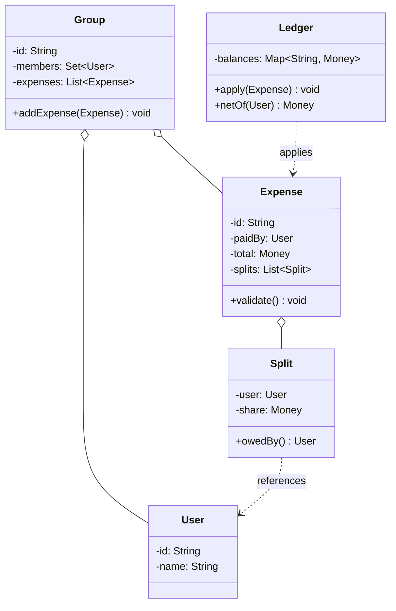

This is the "design Splitwise" question, and it's a favorite because it looks friendly. Everyone has split a dinner bill, so candidates dive straight in, write an `addExpense`, stuff some numbers in a map, and feel good about it. Then the interviewer asks "what if it's split by exact amounts, not equally" and the whole thing wobbles, because the split logic got hardcoded into the service. What's actually being tested is two things: can you find the one calculation that's going to change (how the total gets divided) and put an interface exactly there, and can you keep the ledger honest when two people add expenses to the same group at once. The bill math is easy. The invariant and the race are the round.

Let me walk it the way the [framework post](/interview/low-level-design/lld-framework/) lays out: scope, entities and invariants, the variation axis, then a concurrency pass.

## The problem

Say the scope out loud before writing anything. Three core operations:

- **Add an expense**: someone paid a total, it gets split among a set of users by some rule, and everyone's balance moves accordingly.
- **View balances**: for a user, or for a group, who owes whom and how much.
- **Simplify and settle**: reduce the tangle of IOUs to the fewest transactions, and record a payment that clears a debt.

Explicitly out of scope, and say it: authentication, payment gateways (we record that a settlement happened, we don't move real money), currency conversion, notifications, and any HTTP or persistence. In-memory maps, a `Main` that runs the scenario, no controllers. You've scoped before you coded, the interviewer already likes you more.

## Entities and invariants

Nouns become classes. A `User` is a person. A `Group` owns a set of users and the expenses they share. An `Expense` records who paid, the total amount, and the list of `Split`s it produced, one `Split` per participant carrying that user's share. The `Balance` state lives in a ledger, a map keyed by user telling you the net of everything they've paid and owe. Two enums carry the fixed-value adjectives: `SplitType` (EQUAL, EXACT, PERCENT) and later maybe a `SettlementStatus`. Money is its own small value class, never a raw `double`, because floating point on shared money is how you end up a cent short.

Now the invariants, because they drive both validation and locks:

- **Every expense's splits sum exactly to its total.** If Alice paid 90 and it's split three ways, the three shares must add to 90, not 89.99 and not 90.01. This is the validation the `SplitStrategy` has to enforce before the expense is ever accepted.
- **The net of all balances in the system is always zero.** Every debit has a matching credit. If someone owes 30, someone else is owed 30. The moment the whole ledger doesn't sum to zero, you've lost or minted money, and the design exists to make that impossible.
- **A settlement only moves money that is actually owed.** You can't settle a debt that isn't there, and settling reduces exactly two balances by the same magnitude, one up, one down.

Models carry behavior, not just getters. `Money.add` and `Money.negate` keep the arithmetic in one place, `Split.owedBy()` answers who carries it, `Ledger.netOf(user)` computes a user's position. Constructor injection everywhere, nothing does `new` on a strategy inside a service.



## The variation axis

The follow-up is coming and you already know its shape: "now split by exact amounts," "now by percentage," "now by shares/weights." The split calculation is the thing most likely to change, so it goes behind a `SplitStrategy` interface, day one, before the interviewer asks. That's the move from the [Strategy playbook](/interview/low-level-design/patterns/strategy-variation/): same question ("how does this total divide among these people?"), different logic per policy. And it's the contributor-list shape from that playbook, each participant gets a share, and the shares together reconstruct the total, that reconstruction is exactly the invariant you validate.

Keep the strategy pure, inputs in, decision out, no repositories inside it. The critical detail: whatever the split, the returned shares must sum to the total, so validate it inside the strategy and throw if it doesn't.

```java
// strategies/split/SplitStrategy.java, interface gets the good name
public interface SplitStrategy {
    // pure: who paid what total, among whom, with what params -> per-user shares
    List<Split> split(Money total, List<User> participants, List<Double> params);
}

// strategies/split/EqualSplit.java, params ignored
public class EqualSplit implements SplitStrategy {
    @Override
    public List<Split> split(Money total, List<User> participants, List<Double> params) {
        int n = participants.size();
        Money base = total.divideFloor(n);              // floor to the cent
        Money remainder = total.minus(base.times(n));   // leftover cents from rounding
        List<Split> splits = new ArrayList<>();
        for (int i = 0; i < n; i++) {
            // hand the leftover cents to the first few, so shares still sum to total
            Money share = i < remainder.cents() ? base.plusCent() : base;
            splits.add(new Split(participants.get(i), share));
        }
        return splits; // sums to total by construction
    }
}

// strategies/split/PercentSplit.java, params are percentages that must total 100
public class PercentSplit implements SplitStrategy {
    @Override
    public List<Split> split(Money total, List<User> participants, List<Double> params) {
        if (params.stream().mapToDouble(Double::doubleValue).sum() != 100.0)
            throw new InvalidSplitException("percentages must sum to 100");
        List<Split> splits = new ArrayList<>();
        Money assigned = Money.zero();
        for (int i = 0; i < participants.size(); i++) {
            Money share = (i == participants.size() - 1)
                    ? total.minus(assigned)              // last one absorbs rounding drift
                    : total.percent(params.get(i));
            assigned = assigned.plus(share);
            splits.add(new Split(participants.get(i), share));
        }
        return splits; // last-share trick guarantees the sum is exactly total
    }
}
```

Notice the rounding handling in both. EQUAL splitting 100 three ways can't give three equal cents, so someone eats the extra penny, and I hand it out deliberately instead of letting `sum != total` sneak through. PERCENT lets the last participant absorb the drift. That penny is where the sum-to-total invariant actually lives, and calling it out is a senior signal. An `ExactSplit` would just check the given amounts already sum to the total and pass them through. New split type is a new class, the service never changes.

## Simplify the debts

Once expenses pile up, the raw ledger is a mess of IOUs: A owes B, B owes C, C owes A. Nobody wants to settle three payments when one might do. That's the debt-simplification step, and it's a small graph problem.

The idea, kept short: first net every user, collapse all their individual IOUs into a single number, positive if they're owed money, negative if they owe. Because of the zero-sum invariant, the positives and negatives balance exactly. Then greedily match the biggest debtor to the biggest creditor, settle the smaller of the two magnitudes between them, and repeat. Each match zeroes out at least one person, so you settle everyone in at most n-1 transactions. It's not guaranteed minimal (that's NP-hard in the general case), but the greedy pass is what Splitwise actually ships and what the interviewer wants to hear. Don't code the whole thing under time pressure, net the users, describe the greedy match, move on.

## Making it thread-safe

Now the explicit pass: "let me make this thread-safe." Two users adding expenses to the same group at the same time both read the shared balance map, both compute new balances off the value they read, both write back, and one update is lost. The ledger silently stops summing to zero. Nothing threw.

Restate the invariant at risk: the net of all balances is always zero. The reason this is harder than the parking lot's single-spot claim is that one expense touches many users' balances at once, and a settlement touches exactly two, so this is a multi-entity invariant, not a single-key check-then-act. A `ConcurrentHashMap` makes each individual balance update atomic, but "read three balances, update three balances" as a unit is still a race.

So I guard per user with a `ReentrantLock`, and I acquire the locks for all participants of an expense in a fixed order, sorted by user id, before touching any balance. Sorted order is the whole trick: two expenses that share users will always grab the shared locks in the same sequence, so they can't each hold one and wait on the other. That's how you avoid deadlock on a multi-entity update.

```java
// applying an expense: lock every participant in sorted id order, then update
void apply(Expense expense) {
    List<User> users = expense.participants();
    List<Lock> locks = users.stream()
            .sorted(Comparator.comparing(User::id))   // globally consistent order
            .map(u -> lockFor(u.id()))
            .toList();
    locks.forEach(Lock::lock);
    try {
        for (Split s : expense.splits()) {
            ledger.credit(expense.paidBy(), s.share());   // payer is owed
            ledger.debit(s.owedBy(), s.share());          // participant owes
        }
    } finally {
        locks.forEach(Lock::unlock);   // release order doesn't matter, holding all did
    }
}
```

Narrate exactly that: "an expense is a multi-entity update, so per-user `ReentrantLock`s acquired in sorted id order, which keeps the ledger's zero-sum invariant and can't deadlock because every thread locks in the same order." A settlement between two users is the same pattern with a list of two.

## The takeaway

Splitwise rewards two disciplines. Treat money as a real type and defend the sum-to-total invariant right down to the leftover penny, and treat the split as the one thing you know will change. Get the ledger's zero-sum right under concurrency with ordered locks, keep the split behind an interface, and the design holds up to every follow-up. To add split-by-shares or split-by-adjustment, you write one new class implementing `SplitStrategy` and nothing else changes, that's the sentence you close the round on.

[← Back to Strategy Variation Playbook](/interview/low-level-design/patterns/strategy-variation)
