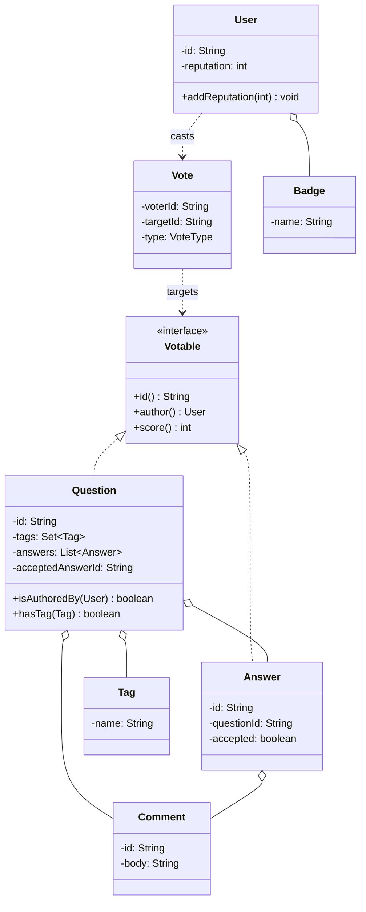

This is the "design Stack Overflow" question, sometimes dressed up as "design a Q&A site" or "design Quora." It looks generous, there's a lot of surface area, questions and answers and votes and comments and badges, and candidates try to model all of it. That's the trap. The interviewer isn't grading how many nouns you can turn into classes. They're watching for two things: can you draw a clean entity model where ownership is obvious and the invariants are stated, and do you notice that the reputation rules (upvote gives +5, accepted answer gives +15, and so on) are a data table, not a pile of magic numbers sprinkled across your vote handlers. Get those two right and the rest is CRUD you can write in your sleep.

Let me walk it the way the [framework post](/interview/low-level-design/lld-framework/) lays out: scope, entities and invariants, the variation axis, then a concurrency pass.

## The problem

Lock the scope out loud before writing anything. The core operations:

- **Post a question**: a user writes a question with a title, body, and a set of tags.
- **Post an answer**: a user answers an existing question.
- **Vote up or down**: on a question or an answer, and a user can change or undo their vote.
- **Accept an answer**: only the question's author picks one answer as accepted.
- **Award reputation**: every vote and every accept moves the target author's reputation by a fixed amount.
- **Search by tag**: find questions carrying a given tag.

Say what's out of scope: auth and sessions, HTTP and REST, persistence, moderation queues, edit history, duplicate detection, full-text search ranking. In-memory maps, a `Main` that runs the scenario, no controllers. Comments and badges I'll model as entities but keep thin, they're not where the interview lives.

## Entities and invariants

Nouns become classes. A `User` has an id and a running `reputation`. A `Question` is authored by a user, carries a `Set<Tag>`, and owns its `Answer`s and `Comment`s. An `Answer` belongs to one question, is authored by a user, and can be flagged accepted. A `Comment` hangs off a question or an answer. A `Vote` records who voted, on which post, and which way. One enum carries the fixed-value adjective: `VoteType` (UPVOTE, DOWNVOTE). A `Badge` is a thin record a user can collect. `Question` and `Answer` share the "can be voted on" shape, so they both implement a small `Votable` interface (an id, an author, a vote tally).

Now the invariants, because they drive both validation and the locks later:

- **A user votes at most once per post.** Voting again either changes the direction or undoes it, it never stacks. This is the one the concurrency pass has to defend, a double-count here silently inflates someone's reputation.
- **Reputation is the sum of vote-driven deltas.** A user's score is never set directly, it only moves through the reputation rules. If you can't reconstruct it from the events, the model is wrong.
- **Only the question's author accepts an answer**, and at most one answer per question is accepted. Any other user calling accept is rejected.
- **An answer belongs to exactly one question for its whole life.** No reparenting, no orphans.

Models carry behavior, not just getters. `Question.isAuthoredBy(user)` answers the accept-permission check itself, `Votable.score()` returns its own net tally, `Question.hasTag(tag)` answers for search. Constructor injection everywhere, nothing does `new` on a service inside another service.



## Why reputation is data-driven

Here's the move most candidates miss. When they get to reputation, they write the numbers inline: inside the upvote handler, `author.addReputation(5)`; inside the accept handler, `author.addReputation(15)`; somewhere in the downvote path, `author.addReputation(-2)`. The values exist but they have no home. When the interviewer says "actually upvoting an answer should give +10, not +5," you're grepping through vote handlers hoping you caught every spot. That's the anti-signal the [data-driven playbook](/interview/low-level-design/patterns/data-driven-variation/) calls magic values scattered through logic.

The values all run the same operation, look up an amount, add it to a user's reputation, so reputation is a table keyed by event, not code. Model the events as an enum and the amounts as one `Map<ReputationEvent, Integer>`:

```java
// models/enums/ReputationEvent.java
public enum ReputationEvent {
    QUESTION_UPVOTED, QUESTION_DOWNVOTED,
    ANSWER_UPVOTED, ANSWER_DOWNVOTED,
    ANSWER_ACCEPTED, DOWNVOTE_PENALTY
}

// services/ReputationService.java
public class ReputationService {
    // the whole rulebook, one place. New rule = one row.
    private static final Map<ReputationEvent, Integer> RULES = Map.of(
        ReputationEvent.QUESTION_UPVOTED,    5,
        ReputationEvent.QUESTION_DOWNVOTED, -2,
        ReputationEvent.ANSWER_UPVOTED,     10,
        ReputationEvent.ANSWER_DOWNVOTED,   -2,
        ReputationEvent.ANSWER_ACCEPTED,    15,
        ReputationEvent.DOWNVOTE_PENALTY,   -1   // the voter also loses a point
    );

    public void apply(ReputationEvent event, User user) {
        Integer delta = RULES.get(event);
        if (delta == null) throw new IllegalArgumentException("no rule for " + event);
        user.addReputation(delta);   // the ONLY place reputation moves
    }
}
```

Now the vote handler doesn't know any numbers. It decides which event happened and hands it off: on an upvote of an answer it calls `reputation.apply(ANSWER_UPVOTED, answer.author())`, and that's the only reputation line in the whole handler. Changing +5 to +10 is one edit to one row. Adding a "bounty awarded" rule is a new enum constant and a new row, no handler changes at all. In the round I'd seed the table as a constant and say the line the playbook wants: "in production this loads from a config file per site policy, the table shape is identical, only the source changes."

## The variation axis

Name it out loud so the interviewer hears you decline Strategy on purpose. The swappable thing here is the reputation scoring, and that variation is data, not a pattern. Reputation isn't an algorithm with branches, it's the same add-a-delta operation over different numbers, so it lives in a table and stays there. Don't wrap it in a `ReputationStrategy` interface, that's a class hierarchy pretending a lookup table is behavior.

There is one place a real Strategy earns its keep, if the interviewer pushes on it: ranking search results. "Show answers by votes" versus "by recency" versus "accepted first, then votes" are genuinely different algorithms over the same list, so a `RankingStrategy` interface is legitimate. Keep it completely separate from the reputation table, one is data and one is behavior, and only build it if asked. Naming both correctly, table for reputation and Strategy for ranking, is itself the signal.

## Making it thread-safe

Now the explicit pass: "let me make this thread-safe." The invariant at risk is a user votes at most once per post, and the deeper one it protects is reputation being an honest sum. Two threads take the same user's first upvote on the same answer at the same time. Both read "no existing vote," both record a vote, both call `reputation.apply(ANSWER_UPVOTED, author)`. The vote count jumps by two and the author gains twenty points off a single click. Nothing threw, the score just quietly lies.

Two shared counters are in play, the post's vote tally and the author's reputation, so both need to be safe and, more importantly, the record-vote-then-adjust-reputation step has to be atomic as a unit. The tally itself is a counter, so `AtomicInteger` (or `LongAdder` if you expect vote storms) is the right primitive for the raw count. But "has this user already voted, and if not, record it and move reputation" is a check-then-act on a single key, the pair (voterId, postId). That whole sequence must run under one lock or one atomic operation, or the check and the act race.

Hold each user's vote on a post in a `ConcurrentHashMap<VoteKey, VoteType>` and do the whole decision inside `compute()`, which runs your check-and-set atomically for that one key:

```java
// record the vote and return the reputation events that must fire, atomically per (voter, post)
List<RepChange> castVote(User voter, Votable post, VoteType type) {
    List<RepChange> changes = new ArrayList<>();
    votes.compute(new VoteKey(voter.id(), post.id()), (key, existing) -> {
        if (type.equals(existing)) return existing;          // same vote again: no-op, once-per-user holds
        post.applyDelta(existing, type);                     // atomic tally move: undo old, apply new
        changes.add(RepChange.of(post, existing, type));     // what reputation owes, computed once
        return type;
    });
    return changes;   // caller applies each change through ReputationService, outside the lock
}
```

The point is the `compute()` block covers exactly the invariant, one user's vote on one post, and nothing wider. I compute the reputation deltas inside the atomic region but apply them through `ReputationService` after it returns, so I'm never calling into another service while holding the map's per-key lock. Because it's keyed on (voter, post), two different users voting on the same answer don't block each other, only a genuine double-submit from the same user serializes, and the loser sees the vote already there and no-ops. Narrate exactly that: "voting is check-then-act on the (voter, post) key, so `compute()` on the vote map covers the once-per-user invariant, and reputation moves only from the delta that block decided."

## The takeaway

Stack Overflow rewards seeing through the surface area. It's a wide problem, but the model underneath is small: a few entities with clear ownership, a handful of invariants worth defending, and one scoring rulebook you keep out of the code. Put reputation in a table so a new scoring rule is a new row and not a hunt through your vote handlers, make the vote-and-reward step atomic per (voter, post) so nobody double-counts, and the design holds. To retune the whole reputation policy, you edit rows in one map and touch no logic, that's the sentence you close the round on.

[← Back to Data-Driven Variation Playbook](/interview/low-level-design/patterns/data-driven-variation)
