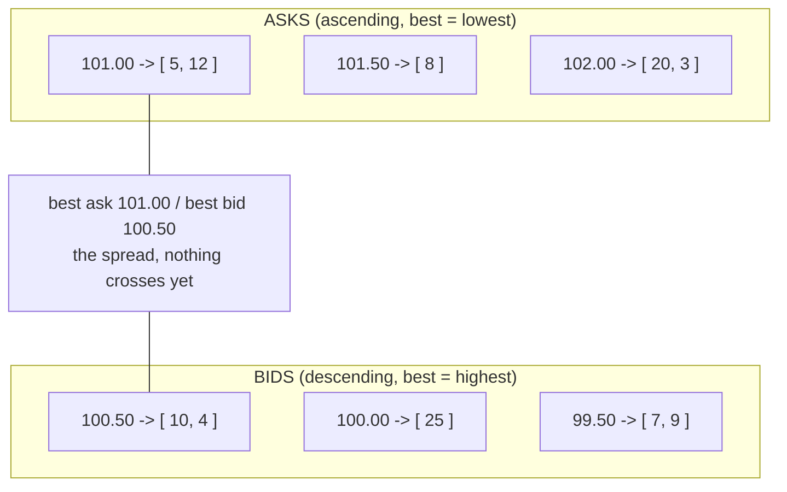

This is the "design a stock exchange matching engine" question, sometimes phrased as "build me a limit order book." It sounds like a systems interview and candidates walk in expecting to talk about pattern folders, an `OrderService`, maybe a `MatchingStrategy` interface right up front. That instinct is wrong here in exactly the way it's wrong for the LRU cache. There's no clever pattern that earns you points. The order book data structure is the whole answer, and price-time priority matching is a loop over it. Get the structure right and the round is basically won. Reach for scaffolding and you've told the interviewer you pattern-match on the word "LLD."

What's actually being tested is narrow: can you pick a structure where "best price" and "cancel this specific order" and "oldest order at this price" are all cheap, and can you match against it without ever scanning the book. The scanning is the trap. A naive list of orders gives you a correct matching engine that's O(n) on every single operation, and if you don't restate the shape you want out loud you won't notice you signed up for it.

## The problem

Four operations, one symbol, in memory:

- `placeLimitOrder(side, price, qty)`: a buy or sell at a limit price for some quantity. Match it against the opposite side as far as it crosses, rest the leftover in the book.
- **Match by price-time priority**: fill against the best price on the other side first, and within one price level fill the oldest order first.
- **Partial fills**: an incoming order can eat several resting orders, and a resting order can be partially consumed and stay in the book with reduced quantity.
- `cancel(orderId)`: pull a resting order out of the book.

Out of scope, and say it out loud: market orders (I'll mention where they'd slot in), settlement and clearing, persistence, multi-symbol routing, self-trade prevention, fees. One symbol, limit orders, in-memory maps, a `Main` that runs the scenario. No controllers.

## Why the data structure is the answer

Start from what price-time priority demands and the structure falls out of it. "Price priority" means I always need the best price on each side instantly: the highest bid a seller can hit, the lowest ask a buyer can lift. "Time priority" means within a single price, orders fill in arrival order, oldest first. And `cancel` means I have to find one specific order by id and yank it without disturbing the others.

A single list of orders satisfies none of that cheaply. Finding the best price is an O(n) scan, cancel is an O(n) search, and matching walks the whole thing. Dead on every operation.

So you split it into two sorted structures, one per side, and inside each price you keep a FIFO queue:

- **Bids**, sorted by price descending, so the highest buy price is on top.
- **Asks**, sorted by price ascending, so the lowest sell price is on top.
- Each price level is a `Queue<Order>` (a `LinkedList` / `ArrayDeque`), append on arrival, poll from the front. That queue **is** time priority, no timestamps needed, insertion order carries it.

`TreeMap<Long, Deque<Order>>` per side does this. `firstKey()` (or `firstEntry()`) gives you the best price in O(log n), the ladder stays sorted as orders come and go, and the FIFO queue under each key gives you the oldest resting order in O(1). The best bid and best ask sit at the top of their respective ladders, and whether they cross is the only question matching ever asks.



The one invariant that a bug will violate: the quantity you can see on a level equals the sum of the resting orders in that level's queue, and an order lives in exactly one place (one price, one side) or in the cancel index, never both stale. Fill an order down to zero and forget to poll it off the queue and you've got phantom liquidity, the book offers a fill that isn't there.

There's a second structure hiding behind `cancel`: to pull order 987 out, I can't scan the ladder. So I keep a side index, `Map<orderId, Order>`, and the `Order` itself knows its price and side. Cancel becomes a lookup, then a remove from that one level's queue. Same trick as the LRU cache: two structures pointed at the same objects, one for sorted access, one for O(1) lookup by id.

## Matching

A new buy at price P crosses against the asks whose price is `<= P`, cheapest first, oldest within a price first, until the buy is filled or the book has nothing left at or below P. Whatever quantity survives that rests in the bid ladder. Sells are the mirror: cross against bids `>= P`, highest first.

The loop is the whole engine. Peek the best level on the opposite side, check if it crosses, take the oldest order there, fill `min(remaining, resting.qty)`, decrement both. If the resting order hit zero, poll it off and drop it from the id index; if the level emptied, remove the key. Repeat until the incoming order is done or nothing crosses.

```java
enum Side { BUY, SELL }

class Order {
    final String id;
    final Side side;
    final long price;
    long qty;                 // remaining, mutated down as it fills
    Order(String id, Side side, long price, long qty) {
        this.id = id; this.side = side; this.price = price; this.qty = qty;
    }
}

class OrderBook {
    // bids: highest price first; asks: natural ascending
    private final TreeMap<Long, Deque<Order>> bids = new TreeMap<>(Collections.reverseOrder());
    private final TreeMap<Long, Deque<Order>> asks = new TreeMap<>();
    private final Map<String, Order> index = new HashMap<>();   // O(1) cancel

    List<Trade> place(Order incoming) {
        List<Trade> trades = new ArrayList<>();
        TreeMap<Long, Deque<Order>> book = (incoming.side == Side.BUY) ? asks : bids;

        while (incoming.qty > 0 && !book.isEmpty()) {
            Map.Entry<Long, Deque<Order>> best = book.firstEntry();
            long bestPrice = best.getKey();
            if (!crosses(incoming, bestPrice)) break;   // spread; stop matching

            Deque<Order> level = best.getValue();
            Order resting = level.peekFirst();           // oldest = time priority
            long fill = Math.min(incoming.qty, resting.qty);

            incoming.qty -= fill;
            resting.qty  -= fill;
            trades.add(new Trade(incoming.id, resting.id, bestPrice, fill));

            if (resting.qty == 0) {                      // fully consumed, retire it
                level.pollFirst();
                index.remove(resting.id);
                if (level.isEmpty()) book.remove(bestPrice);
            }
        }

        if (incoming.qty > 0) rest(incoming);            // leftover joins the book
        return trades;
    }

    private boolean crosses(Order o, long bestOpposite) {
        return (o.side == Side.BUY) ? o.price >= bestOpposite : o.price <= bestOpposite;
    }

    private void rest(Order o) {
        TreeMap<Long, Deque<Order>> book = (o.side == Side.BUY) ? bids : asks;
        book.computeIfAbsent(o.price, p -> new ArrayDeque<>()).addLast(o);   // FIFO append
        index.put(o.id, o);
    }

    void cancel(String orderId) {
        Order o = index.remove(orderId);
        if (o == null) throw new OrderNotFoundException(orderId);
        TreeMap<Long, Deque<Order>> book = (o.side == Side.BUY) ? bids : asks;
        Deque<Order> level = book.get(o.price);
        if (level != null) {
            level.remove(o);                 // O(level size); fine, levels are shallow
            if (level.isEmpty()) book.remove(o.price);
        }
    }

    Long bestBid() { return bids.isEmpty() ? null : bids.firstKey(); }
    Long bestAsk() { return asks.isEmpty() ? null : asks.firstKey(); }
}
```

A few things I'd say out loud while writing this. The fill is always `min` of the two remaining quantities, that single line is the whole partial-fill story, and the retire-when-zero block right after it is where the invariant lives or dies. Trades print at the resting order's price, not the incoming price, that's how real exchanges work, the order that was there first sets the price. Prices are `long` (cents or ticks), never `double`, because you do not want floating point deciding whether two orders cross. And `cancel` doing `level.remove(o)` is O(level depth), not O(1), which is honest and fine: a single price level holds a handful of orders, not the whole book. If the interviewer pushes, the upgrade is an intrusive doubly-linked node per order so the unlink is O(1), the same handle-map move as the structure-driven playbook's order-book skeleton.

Market orders, if they ask: same loop, you just drop the `crosses` check and take liquidity at any price until filled or the book runs dry. It's a two-line change, which is the point, the structure already supports it.

## The variation axis

Here's the honest part, and you should say it before the interviewer goes hunting for a pattern: there's almost nothing to swap. The problem is the structure. Entities are thin (`Order`, `Trade`, a `Side` enum), and the design is `OrderBook` owning two ladders and an index. No Strategy folder, no State machine, and forcing one in makes the answer worse.

The one plausible seam is the matching rule itself. Price-time priority is the default, but some venues use pro-rata (split an incoming fill across all resting orders at the best price in proportion to their size) or price-time with a pro-rata component. That is a genuine `MatchingStrategy` interface if it comes up: same inputs (incoming order, best level), different allocation of the fill. Name it, say "today it's strict price-time and the FIFO queue encodes it, if you want pro-rata that's where an allocation Strategy goes," and move on. Don't build it unless asked. Naming the fork and declining to over-build is the same senior signal as placing an interface correctly elsewhere.

## Making it thread-safe

Now the explicit pass. The tempting move is to slap a lock on the book and let threads in, or worse, a `ReadWriteLock` because "quotes are read a lot." Both miss what actually matters here, which is ordering, not just mutual exclusion.

Restate the invariant that's really at risk: orders for one symbol must be processed in the exact order they arrived. Price-time priority is a lie if arrival order isn't preserved, two orders racing into the same price level under a lock can be enqueued in either order, and now "time priority" depends on who won a lock, which is nondeterministic. Locking the book on every op gives you mutual exclusion but says nothing about the sequence, and the sequence is the product.

So the clean move is the framework's per-entity-ordering menu item: one single-consumer thread per symbol draining an incoming queue. Producers (many client threads) just `offer` orders onto a `BlockingQueue` for that symbol. One consumer thread per symbol pulls them off one at a time and applies each to the `OrderBook`. The book itself needs no locks at all, because only ever one thread touches it. Ordering comes from the single consumer plus the FIFO queue, not from locking.

```java
class SymbolWorker implements Runnable {
    private final BlockingQueue<Command> inbox = new LinkedBlockingQueue<>();
    private final OrderBook book;                       // owned solely by this thread

    SymbolWorker(OrderBook book) { this.book = book; }
    void submit(Command c) { inbox.offer(c); }          // any thread, just enqueues

    public void run() {
        while (!Thread.currentThread().isInterrupted()) {
            try {
                Command c = inbox.take();               // one at a time, in arrival order
                c.applyTo(book);                        // place or cancel, single-threaded
            } catch (InterruptedException e) {
                Thread.currentThread().interrupt();
            }
        }
    }
}
```

Narrate why this beats locking the book. A lock serializes access but still lets the scheduler decide which thread gets in first, so two orders that arrived microseconds apart can be applied out of order, and you've corrupted time priority without a single data race firing. The single-consumer design makes arrival order the truth by construction: the queue is FIFO, the consumer is one thread, matching is deterministic. It's also how real matching engines run, one writer per book, and saying that (single-writer per symbol is the production reality) scores higher than a heroic fine-grained locking sketch. Different symbols get different workers and run fully parallel, which is where your throughput comes from, you scale by adding symbols, not by contending on one book.

## The takeaway

The matching engine is a clean structure-driven problem hiding behind an intimidating name. Two `TreeMap` ladders (bids descending, asks ascending), a FIFO queue per price for time priority, and an id index for O(1) cancel, that's the design, and the match loop is just "peek best, does it cross, fill the min, retire on zero." State the invariant that a level's quantity equals the sum of its resting orders and you catch the phantom-liquidity bug before it happens. The variation axis is nearly empty, one possible `MatchingStrategy` seam for pro-rata, name it and don't build it. And thread-safety is an ordering problem, not a locking one, so one consumer thread per symbol draining a queue beats wrapping the book in locks. Keep `OrderBook` behind a clean API and every one of those follow-ups lands without touching what you already wrote.

[← Back to Structure-Driven Problems Playbook](/interview/low-level-design/patterns/structure-driven)
