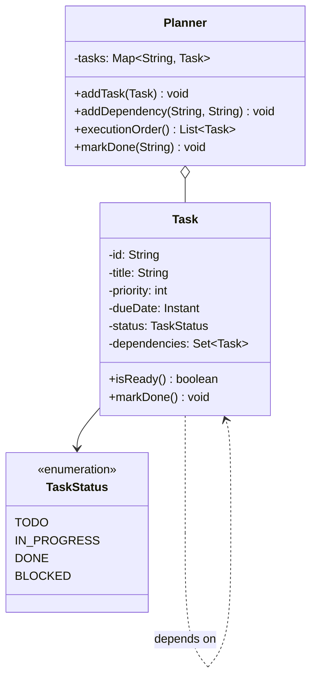
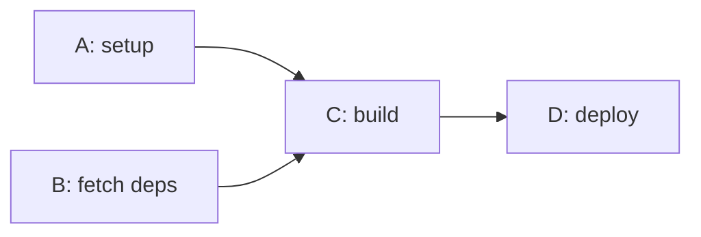

This is the "design a task scheduler" question, sometimes dressed up as a todo planner, a build system, or a job runner. It looks friendly, everyone has written a todo list, and candidates start sketching a `Task` with a boolean `done` and a `list()` method. Then the interviewer says the one word that turns it into a real round: "task B needs A finished first." Now it's not a list, it's a graph, and the whole thing hinges on two moves. Can you order the tasks so nothing runs before its prerequisites (a topological sort), and can you detect the cycle that makes ordering impossible instead of looping forever. Get those, and the priorities and due dates are garnish.

Let me walk it the way the [framework post](/interview/low-level-design/lld-framework/) lays out: scope, entities and invariants, the core algorithm, the variation axis, then a concurrency pass.

## The problem

Lock the scope before writing anything. A handful of operations, said out loud:

- **Create a task**: an id, a title, a priority, maybe a due date, starts in TODO.
- **Declare a dependency**: task B needs task A done first, an edge from A to B.
- **List an execution order**: return the tasks in an order where every task comes after all of its dependencies.
- **Mark done**: complete a task, which may unblock the ones waiting on it.

Explicitly out of scope, and say this: I'm not building cron, no wall-clock triggers, no distributed workers across machines, no persistence or retries-with-backoff. This is the in-memory core, a `Main` that runs the scenario, no controllers. What I am defending is correctness of the ordering and the cycle check.

## Entities and invariants

Nouns become classes. A `Task` holds its id, title, priority, optional due date, a status, and the set of tasks it depends on. A `Planner` (the `TaskGraph`) owns all the tasks and the dependency edges between them, and it's the thing that computes an order. A dependency is just a directed edge, A points to B meaning "A must finish before B starts," so I don't need a heavyweight `Dependency` class, the edge lives as a reference inside the task. One enum carries the lifecycle: `TaskStatus` is TODO, IN_PROGRESS, DONE, BLOCKED.

Now the invariants, because they drive both the validation and the locks:

- **No cyclic dependencies.** A cycle (A needs B, B needs A) means no valid order exists. This is a hard error, not a warning. I detect it and throw, I never silently drop an edge or spin.
- **A task can start only when all its dependencies are DONE.** Until then it's BLOCKED. The moment the last prerequisite completes, it becomes READY (I model READY as a TODO task with zero unmet deps, not a separate status).
- **An edge points from prerequisite to dependent, one direction only.** If A must precede B, adding B precedes A too is exactly the cycle the first invariant forbids.

Models carry behavior. `Task.isReady()` answers whether its unmet-dependency count is zero, `Task.markDone()` flips its own status, `Task.dependsOn(other)` records an edge. Constructor injection for the prioritization policy, nothing news up a strategy inside the planner.



A tiny DAG to fix the picture, C waits on both A and B:



A valid order is A, B, C, D or B, A, C, D. What's never valid is C before A.

## The core: dependency ordering

The meat is a topological sort, and the clean way to write it under time pressure is Kahn's algorithm. The idea is simple: repeatedly take any task whose dependencies are all satisfied, emit it, and pretend it's gone, which may satisfy the tasks that were waiting on it. Track how many unmet dependencies each task has (its in-degree), start with the zero-degree tasks, and every time you emit one, decrement its dependents.

```java
// Planner.executionOrder(): Kahn's topological sort with cycle detection
public List<Task> executionOrder() {
    Map<Task, Integer> unmet = new HashMap<>();
    for (Task t : tasks.values()) {
        unmet.put(t, t.dependencies().size());        // in-degree = prerequisites
    }

    // READY set: everything with no unmet dependencies, ordered by policy
    PriorityQueue<Task> ready = new PriorityQueue<>(prioritization.comparator());
    for (Task t : tasks.values()) {
        if (unmet.get(t) == 0) ready.add(t);
    }

    List<Task> order = new ArrayList<>();
    while (!ready.isEmpty()) {
        Task t = ready.poll();                         // policy picks among the ready ones
        order.add(t);
        for (Task dependent : dependentsOf(t)) {       // tasks that were waiting on t
            int left = unmet.merge(dependent, -1, Integer::sum);
            if (left == 0) ready.add(dependent);       // just became READY
        }
    }

    if (order.size() != tasks.size()) {                // some task never hit zero in-degree
        throw new CyclicDependencyException(remaining(unmet, order));
    }
    return order;
}
```

The cycle check falls out for free, that's the part people miss. If a cycle exists, the tasks inside it never reach zero unmet dependencies, so they never enter the ready set, so the emitted count comes up short. When `order.size()` is smaller than the task count, the leftover tasks are exactly the cyclic ones, and I throw with them named rather than returning a partial order that lies. BLOCKED versus READY is the same idea seen live: a task is BLOCKED while its unmet count is above zero, and it flips to READY the instant the count hits zero. That's why `markDone` on a real run just decrements dependents and promotes any that reach zero.

## The variation axis

Here's where the two variation types in this problem separate, and naming both is the senior move.

First, the dependency edges themselves are **data**, not code. The shape of the graph is entirely input: who depends on whom is a set of edges the caller adds at runtime. There's no `if (task == build)` logic anywhere, adding a new dependency is `addDependency("A", "B")`, one data edge, zero new classes. That's straight out of the [data-driven playbook](/interview/low-level-design/patterns/data-driven-variation/), the ordering constraints live in the graph, and the graph is just data.

Second, and separately, the **policy for breaking ties among READY tasks** is the swappable algorithm. When three tasks are all ready to go, which runs first? By highest priority, by earliest due date, by shortest estimated duration. Those are genuinely different logic, so that's a Strategy, injected as a `Comparator`:

```java
// strategies/priority/PrioritizationStrategy.java
public interface PrioritizationStrategy {
    Comparator<Task> comparator();                     // used to order the READY set
}

// strategies/priority/ByPriority.java, higher priority first
public class ByPriority implements PrioritizationStrategy {
    @Override public Comparator<Task> comparator() {
        return Comparator.comparingInt(Task::priority).reversed();
    }
}

// strategies/priority/ByDueDate.java, earliest deadline first
public class ByDueDate implements PrioritizationStrategy {
    @Override public Comparator<Task> comparator() {
        return Comparator.comparing(Task::dueDate);
    }
}
```

Keep the two axes apart in your head and out loud. The edges are data because every ordering follows the same rule (a task waits for its prerequisites), only the wiring differs. The prioritization is a strategy because "highest priority" and "earliest due date" are different computations. Merging them into one fat `SchedulingStrategy` would drag the graph traversal along every time you added a new tie-breaker, so don't. The topological constraint is fixed and data-fed, the tie-break within it is the pluggable seam.

## Making it thread-safe

Now the explicit pass. The interesting version is a pool of workers pulling ready tasks and running them concurrently, and two invariants are suddenly at risk.

First, a task must be claimed by exactly one worker. This is the classic pick-then-claim race: two workers both see task T sitting in READY, both grab it, both run it, and now it executes twice. The fix is that picking can be stale but claiming cannot. The claim is a single-key check-then-act, flip the status from READY to IN_PROGRESS atomically, and exactly one thread wins:

```java
// pick-then-claim: many workers may see the same ready task, one claim wins
Task claimNext() {
    while (true) {
        Task pick = readyQueue.poll();                 // may be stale by the time we act
        if (pick == null) return null;                 // nothing ready right now
        // atomic CAS on this one task's status; loser re-polls
        if (pick.tryStart()) return pick;              // READY -> IN_PROGRESS, returns false if already taken
        // lost the race, someone started it first, poll again
    }
}
```

Second, completing a task may unblock its dependents, and that update has to be safe. When a worker finishes T, it walks T's dependents and decrements each one's unmet-dependency count. If two prerequisites of the same task finish at the same moment, both decrements have to land, or the dependent's count is wrong and it either never wakes up (deadlocked with work available) or wakes early (runs before a prerequisite finished, the invariant we exist to protect). So the unmet counter per task is an `AtomicInteger`, and the promotion is keyed off the atomic result:

```java
void complete(Task t) {
    t.markDone();
    for (Task dependent : dependentsOf(t)) {
        if (dependent.decrementUnmet() == 0) {         // AtomicInteger.decrementAndGet
            readyQueue.add(dependent);                 // exactly the thread that hit zero promotes it
        }
    }
}
```

Narrate exactly that: claiming a task is single-key check-then-act so a CAS on its status covers the double-run race, and the unmet-dependency count is an atomic counter so concurrent completions can't corrupt when a task becomes ready. I wouldn't lock the whole planner around the ready queue, that serializes the hottest path in the system, a concurrent queue plus per-task atomics keeps the workers moving.

## The takeaway

The task planner rewards separating the two things that vary. The graph of dependencies is data, so a new prerequisite is one edge and nothing else moves. The order in which ready tasks fire is policy, so a new scheduling rule is one new `PrioritizationStrategy` and nothing else moves. In between sits the one algorithm you have to get right, Kahn's sort, which orders the graph and hands you cycle detection in the same pass. Keep the claim atomic, keep the unmet counters atomic, and the concurrent version holds. To add "run shortest tasks first," you write one comparator. To add a new dependency, you add a data edge. That's the sentence you close the round on.

[← Back to Data-Driven Variation Playbook](/interview/low-level-design/patterns/data-driven-variation)
