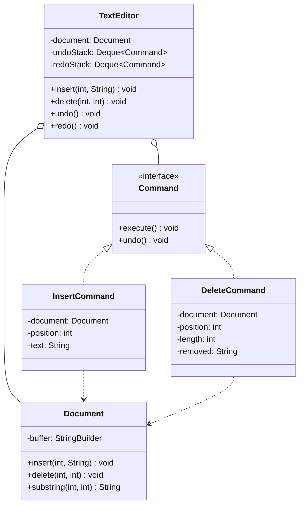

This is the "design a text editor with undo/redo" question, and the trap is baked right into the name. Candidates hear "text editor" and start building a text buffer, gap buffers, piece tables, rope data structures, the whole rendering rabbit hole, and forty minutes later they've got a fast buffer and no undo. The buffer is not the interview. The interviewer said "undo/redo" out loud and that's the tell: the real test is whether you model every mutation as a reversible Command object, so that undo is just running the operation backwards. Get that and a plain `StringBuilder` for the buffer is completely fine. Miss it and no data structure saves you.

Let me walk it the way the [framework post](/interview/low-level-design/lld-framework/) lays out: scope, entities and invariants, the variation axis, then a concurrency pass.

## The problem

Lock the scope before you write anything. The core operations are small:

- **Insert text**: put a string into the document at a position.
- **Delete text**: remove a range from the document.
- **Undo**: reverse the last operation, restoring the exact prior state.
- **Redo**: re-apply the last undone operation.

Explicitly out of scope, and say it: rich text (fonts, bold, colours), the rendering and layout side, cursor and selection UI, files and persistence, search-and-replace. The buffer itself is just an in-memory `StringBuilder`, a `Main` runs the scenario, no controllers, no HTTP. If the interviewer wants the rendering and formatting side, that's a different problem, point them at the document-editor case study and keep this one about the operation log.

## Entities and invariants

Nouns become classes, and here the interesting nouns aren't the text, they're the operations. A `Document` wraps the buffer and exposes raw mutators. A `Command` interface reifies one edit with `execute()` and `undo()`. The `TextEditor` owns the `Document` and two stacks, an undo stack and a redo stack, and drives the whole thing.

Now the invariants, because they're what the whole design exists to protect:

- **Undo then redo restores the exact prior state.** Run an edit, undo it, redo it, and the document is byte-for-byte what it was after the first execute. Off-by-one on a re-insert index is the classic way to break this.
- **Any new edit clears the redo stack.** The moment the user types something fresh, the "future" they'd undone into no longer exists. Forget this and users redo into a timeline that was overwritten, which is the bug interviewers test for deliberately: type, undo, type, redo.
- **A command captures enough state to reverse itself.** An `InsertCommand` knows its position and text. A `DeleteCommand` must remember the text it removed, or undo has nothing to put back.

Models carry behavior, not just getters. `Document.insert(pos, text)` and `Document.delete(pos, len)` know how to mutate the buffer, `Document.substring(pos, len)` reads a range so a delete can capture what it's about to destroy. Constructor injection everywhere, the editor gets its `Document` in the constructor, commands get the `Document` they act on.



## The variation axis

This one isn't a guess, the problem hands you the pattern. Undo/redo means the operation needs a lifecycle beyond call-and-forget, you have to store enough to reverse it later, and that's exactly when you [reify the operation into a Command object](/interview/low-level-design/patterns/command-variation/). Each edit becomes a `Command` with `execute()` and `undo()`, capturing enough state during execution to reverse itself.

The key design call is what each command stores. `InsertCommand` is cheap: to undo an insert you delete the same length at the same position, so it holds position and text and nothing else. `DeleteCommand` is the one people get wrong. To undo a delete you have to reinsert what was removed, so the command has to capture the removed text during `execute()`, before the buffer forgets it. That captured payload is the inverse data, and storing it is what makes undo O(1) and correct. The rejected alternative is snapshotting the whole document on every keystroke (a Memento per edit), that's memory-blind on anything bigger than a toy, reject it by name and say why: for a 10MB document you'd keep a 10MB copy per edit, when the delete only touched twelve characters.

```java
// commands/Command.java, the interface gets the good name
public interface Command {
    void execute();
    void undo();
}

// commands/InsertCommand.java
public class InsertCommand implements Command {
    private final Document document;
    private final int position;
    private final String text;
    public InsertCommand(Document document, int position, String text) {
        this.document = document;
        this.position = position;
        this.text = text;
    }
    @Override public void execute() { document.insert(position, text); }
    @Override public void undo()    { document.delete(position, text.length()); }
}

// commands/DeleteCommand.java, captures the removed text so undo can reinsert it
public class DeleteCommand implements Command {
    private final Document document;
    private final int position;
    private final int length;
    private String removed;   // inverse data, captured during execute()
    public DeleteCommand(Document document, int position, int length) {
        this.document = document;
        this.position = position;
        this.length = length;
    }
    @Override public void execute() {
        this.removed = document.substring(position, length);  // capture BEFORE deleting
        document.delete(position, length);
    }
    @Override public void undo() { document.insert(position, removed); }
}
```

The editor is the two-stack machine, and the discipline lives here. Execute a command, push it on undo, and clear redo. Undo pops the undo stack, runs `undo()`, pushes onto redo. Redo pops the redo stack, runs `execute()`, pushes back onto undo. The redo-clear on a fresh edit is the line to say out loud, it's the invariant most candidates drop.

```java
// TextEditor.java
public class TextEditor {
    private final Document document;
    private final Deque<Command> undoStack = new ArrayDeque<>();
    private final Deque<Command> redoStack = new ArrayDeque<>();

    public TextEditor(Document document) { this.document = document; }

    public void insert(int position, String text) {
        run(new InsertCommand(document, position, text));
    }
    public void delete(int position, int length) {
        run(new DeleteCommand(document, position, length));
    }
    private void run(Command command) {
        command.execute();
        undoStack.push(command);
        redoStack.clear();          // a new edit invalidates the redo timeline
    }
    public void undo() {
        if (undoStack.isEmpty()) return;
        Command command = undoStack.pop();
        command.undo();
        redoStack.push(command);
    }
    public void redo() {
        if (redoStack.isEmpty()) return;
        Command command = redoStack.pop();
        command.execute();          // execute() re-runs the same forward operation
        undoStack.push(command);
    }
}
```

Notice redo just calls `execute()` again, the same forward operation that ran the first time, no special-case code. That's the payoff of reifying the edit: undo and redo are the command run backwards and forwards, and the editor never needs to know whether it's holding an insert or a delete. In a real editor you'd also cap the undo stack and evict the oldest, worth mentioning the memory bound out loud even if you don't code it.

## Making it thread-safe

Say the honest thing first: a text editor is almost always single-user, one person typing into one document, so the operations are naturally sequential and there's no race to solve. Over-engineering a lock story here reads worse than not needing one. So I'd tell the interviewer: "this is single-user, so it's sequential, and I'll spend the saved time making undo exact and proving `undo(redo(x)) == x` in Main instead."

If they push and say make it concurrent, the boundary is clear. The unit that must be atomic is command-execute plus the stack push together, because a half-applied edit that's already been popped off a stack, or a `DeleteCommand` that captured its `removed` text against a buffer another thread has since mutated, corrupts the invariant. That's one critical section, so a single lock around the editor's `run`, `undo`, and `redo` covers it, and I'd say plainly that this serializes edits, which for one document is the correct trade, not a bottleneck. What I would not do is pretend a lock buys real multi-user editing. The moment two people edit the same document live, positions shift under each other and you're into Operational Transformation or CRDTs, a genuinely different problem, and I'd name that boundary rather than hand-wave a lock at it. Scoping that out honestly scores better than a fake answer.

## The takeaway

The text editor rewards seeing past the buffer. The whole design is one interface, `Command`, two implementations that each know how to reverse themselves, and a two-stack editor that runs them forward and backward. Capture the inverse data (the removed text on a delete), clear redo on every new edit, and the invariants hold. And it extends cleanly: a new editing operation, replace, indent, paste, is a new class implementing `Command`, and undo/redo already works for it with zero changes to the editor. That's the sentence you close the round on.

[← Back to Command Variation Playbook](/interview/low-level-design/patterns/command-variation)
