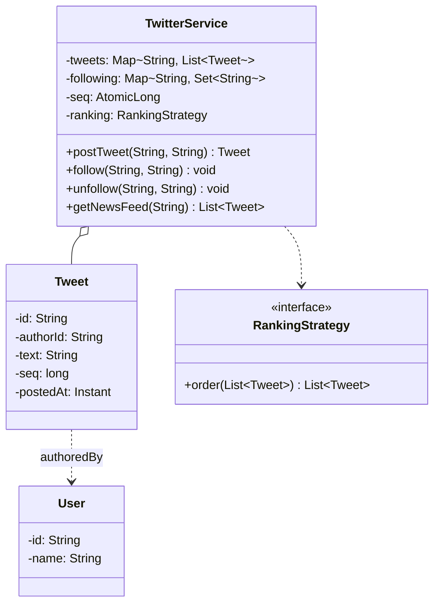

This is the "design Twitter" question, sometimes dressed up as "design a news feed" or "design Instagram," and it catches people the same way every time. Candidates hear it and start building tweet CRUD: a `Tweet` class, a `postTweet`, maybe a `deleteTweet` for good measure, and they burn fifteen minutes there. But nobody asks this question to see if you can put a string in a map. The whole thing lives in one method, `getNewsFeed(user)`, and the two real questions hiding inside it are: how do you assemble a feed out of everyone a person follows (that's fan-out), and in what order do you show it (that's ranking). Get those two and the rest is a couple of maps.

Let me walk it the way the [framework post](/interview/low-level-design/lld-framework/) says to: scope, entities and invariants, the variation axis, then a concurrency pass.

## The problem

Lock the scope out loud before writing anything. The core operations are small in number:

- **postTweet(user, text)**: append a tweet to that user's own list of tweets, stamped with a time.
- **follow(follower, followee)** and **unfollow(follower, followee)**: edit the follow graph.
- **getNewsFeed(user)**: return the most recent (or ranked) tweets from everyone the user follows, plus the user's own tweets, capped at some page size like the latest 10.

Explicitly out of scope, and say it: likes, retweets, replies, media, hashtags and search, direct messages, and anything HTTP or persistence. In-memory maps, a `Main` that runs the scenario, no controllers. The interviewer wants to see feed assembly, not a social network.

## Entities and invariants

Nouns become classes. A `User` has an id, and a `Tweet` records who authored it, the text, and the time it was posted. The follow graph and the per-user tweet lists don't want to live on the `User` object, they want to live in the service's storage, because the feed read has to reach across many users at once. So storage is two maps: `tweets`, a `Map<userId, List<Tweet>>` holding each user's own timeline newest-last, and `following`, a `Map<userId, Set<userId>>` holding who each user follows.

Now the invariants, because they drive both the read logic and the locks later:

- **A feed only shows tweets from users you follow, plus your own.** This is the definition of the product. The set you merge over is exactly `following.get(u)` union `{u}`, never the whole tweet universe.
- **Ordering is consistent.** Two calls to `getNewsFeed` with no writes in between return the same order. That means every tweet needs a monotonic ordering key, a global sequence number or a timestamp that never ties in a way that flips. I use a global `AtomicLong` sequence so two tweets in the same millisecond still order deterministically.
- **A tweet is immutable once posted.** Author, text, and time don't change. That immutability is what lets readers merge a tweet across threads without copying it.

Models carry behavior. `Tweet` is a final value object that knows how to compare itself by sequence, `User` holds its own id. The service owns the graph and the timelines.



## The variation axis

There are two variation axes here, and naming both out loud is the senior move. Don't merge them.

**Axis one, ranking, is a Strategy.** The follow-up is coming: "now rank by engagement," "now boost recent tweets," "now show top tweets first." How the merged tweets get ordered is the thing most likely to change, so it goes behind a `RankingStrategy` interface, day one. Same question ("in what order does this feed go?"), different logic per policy, exactly the move from the [Strategy playbook](/interview/low-level-design/patterns/strategy-variation/). Keep it pure, tweets in, ordered tweets out, no repositories inside it:

```java
// strategies/ranking/RankingStrategy.java, interface gets the good name
public interface RankingStrategy {
    List<Tweet> order(List<Tweet> candidates);   // pure: candidates in, decision out
}

// strategies/ranking/ChronologicalRanking.java, newest first
public class ChronologicalRanking implements RankingStrategy {
    @Override public List<Tweet> order(List<Tweet> candidates) {
        candidates.sort(Comparator.comparingLong(Tweet::seq).reversed());
        return candidates;
    }
}

// strategies/ranking/EngagementRanking.java, score then break ties by recency
public class EngagementRanking implements RankingStrategy {
    private final EngagementIndex engagement;
    public EngagementRanking(EngagementIndex engagement) { this.engagement = engagement; }
    @Override public List<Tweet> order(List<Tweet> candidates) {
        candidates.sort(Comparator
            .comparingDouble((Tweet t) -> engagement.score(t)).reversed()
            .thenComparing(Comparator.comparingLong(Tweet::seq).reversed()));
        return candidates;
    }
}
```

**Axis two, fan-out, is a design choice worth naming even though it isn't an interface you'd necessarily build.** There are two ways to assemble a feed:

- **Pull (fan-out on read).** Store nothing extra. When someone opens their feed, gather the timelines of everyone they follow and merge them at read time. Cheap writes (a post is one append), expensive reads (you touch every followee).
- **Push (fan-out on write).** Keep a precomputed feed list per user. When someone posts, push that tweet into the feed of every one of their followers. Cheap reads (your feed is already assembled), expensive writes (one post fans out to millions).

The tradeoff has a name, the celebrity problem. Push falls over when a user has 90 million followers, because a single tweet triggers 90 million list writes. Pull falls over for a user who follows tens of thousands of active accounts, because every feed open does a huge merge. Real systems go hybrid: push for normal users, pull for celebrities, then merge the two at read time. In an interview I build pull, because it's the honest, self-contained version, and I say the hybrid sentence out loud to show I know where it breaks.

Here's the pull read, and the reason pull is interesting: you don't merge N whole timelines and then sort, you only want the latest 10, so it's a **k-way merge with a heap**. Each followee's timeline is already sorted newest-last. Seed a max-heap with the newest tweet from each source, pop the winner, push that source's next tweet, repeat until the page is full. That's O(pageSize x log followees) instead of sorting everything.

```java
// services/TwitterService.java, the merged-feed read
public List<Tweet> getNewsFeed(String userId) {
    Set<String> sources = new HashSet<>(following.getOrDefault(userId, Set.of()));
    sources.add(userId);   // your own tweets show in your feed

    // each source contributes a cursor into its own snapshot, newest first
    PriorityQueue<Cursor> heap =
        new PriorityQueue<>(Comparator.comparingLong((Cursor c) -> c.peek().seq()).reversed());
    for (String src : sources) {
        List<Tweet> timeline = tweets.get(src);   // snapshot reference, see concurrency
        if (timeline != null && !timeline.isEmpty()) {
            heap.add(new Cursor(timeline));        // cursor starts at newest
        }
    }

    List<Tweet> merged = new ArrayList<>();
    while (!heap.isEmpty() && merged.size() < PAGE_SIZE) {
        Cursor c = heap.poll();
        merged.add(c.peek());
        if (c.advance()) heap.add(c);              // push this source's next-newest back
    }
    return ranking.order(merged);   // Strategy gets the final say on order
}
```

Note the two axes staying separate. The k-way merge is chronological on the way in because that's how it prunes to the latest few cheaply, then `RankingStrategy` decides the final order. If engagement ranking wants a wider candidate pool it can ask the merge for a bigger page, but the merge and the ranker never collapse into one method. Keep `RankingStrategy` its own interface, never fold fan-out into it, or every new ranking variant would have to reimplement the merge.

## Making it thread-safe

Now the explicit pass: "let me make this thread-safe." Two shared structures race, and they race differently, so they get different treatment.

First, the per-user tweet timelines. Posting appends to a user's list while readers are merging that same list. If a reader iterates while a writer appends, a plain `ArrayList` throws `ConcurrentModificationException`, or worse, hands back a torn read. The invariant at risk is a consistent snapshot: a feed read should see a coherent point-in-time view, it doesn't have to see a tweet posted one microsecond ago. So hold the timelines in a `ConcurrentHashMap<String, List<Tweet>>` where each list is append-safe. A `CopyOnWriteArrayList` is the clean fit here: appends copy, but reads are lock-free and the iterator is a stable snapshot, which is exactly the read semantics the feed wants. Tweets are immutable, so once the reader grabs the list reference, merging it needs no further locking.

```java
public Tweet postTweet(String userId, String text) {
    Tweet t = new Tweet(newId(), userId, text, seq.incrementAndGet(), clock.instant());
    tweets.computeIfAbsent(userId, k -> new CopyOnWriteArrayList<>()).add(t);
    return t;   // seq from a global AtomicLong keeps ordering deterministic
}
```

That `computeIfAbsent` matters: two threads posting a user's first-ever tweet at the same time must not each install a separate list and lose one. `computeIfAbsent` on a `ConcurrentHashMap` makes the create-if-missing atomic per key.

Second, the follow graph. `follow` and `unfollow` mutate a user's followee set while `getNewsFeed` reads it to decide which timelines to merge. The invariant is weaker than it looks: if you unfollow someone the exact instant they open their feed, either seeing or not seeing your last tweet is acceptable, both are legal outcomes of a concurrent operation. What's not acceptable is a crash mid-iteration. So the followee sets are `ConcurrentHashMap.newKeySet()` (a concurrent set), and the read copies the set into a local `HashSet` before merging. The copy hands the read a stable source list even if a follow lands halfway through.

I'd narrate exactly that: "timelines are `CopyOnWriteArrayList` so the merge reads a lock-free snapshot of immutable tweets, the follow graph is a concurrent set copied per read, and ordering is deterministic because `seq` comes from a single `AtomicLong`. No global lock, because the hottest path, reading a feed, never needs to block a write."

## The takeaway

The Twitter feed rewards knowing where the real work is. It's two small maps and a value object, but the feed read is a k-way merge with a heap, and the ordering is one swappable interface. Get the merge right so you only touch the tweets you'll actually return, keep ranking behind `RankingStrategy`, and name the pull-versus-push tradeoff with the celebrity problem so the interviewer knows you see past the toy version. To add engagement ranking, or a recency boost, or a "top tweets" mode, you write one new class implementing `RankingStrategy` and nothing else changes, that's the sentence you close the round on.

[← Back to Strategy Variation Playbook](/interview/low-level-design/patterns/strategy-variation)
