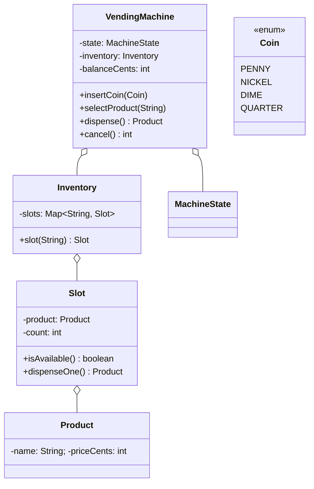

Everyone treats "design a vending machine" as a warm-up, and I used to as well, right up until an interviewer let me finish my clean little enum-and-switch version and then asked "okay, what does inserting a coin do while it's dispensing?" and my switch statement grew a fourth case in every method and I watched my own code turn into the thing I'd have failed a candidate for. That's the whole trap. The vending machine isn't testing whether you can model a product and a coin. It's testing whether you can model a lifecycle where the same button means different things at different times, and keep the rules for each moment in one place instead of smeared across the codebase.

The tell is right there in the requirements if you listen for it: insert a coin, select a product, dispense. The exact same three verbs, but "insert a coin" while idle starts a session, while it already has your money it accumulates, and while it's dispensing it should be refused. Different work, same call. That's the State pattern's home turf, and the interviewer knows it, so the win here is naming that early and building around it instead of discovering it halfway through.

## The problem

Lock the scope out loud before you write anything. Four operations, that's the machine:

- **insertCoin(coin)**: feed money in, one coin at a time.
- **selectProduct(slotId)**: pick a row; if you've paid enough and it's in stock, this commits the sale.
- **dispense()**: drop the product and return change.
- **cancel()**: bail out and get your money back.

Explicitly out of scope, and say so: card and UPI payments (one payment path keeps the state machine legible), the physical coin-return mechanics, restocking workflows, multi-item carts, and any persistence. In-memory, single machine, and I'll assume concurrency matters because at SDE-2 and up it always does.

## Entities and invariants

Nouns first, straight to classes. `VendingMachine` is the context that holds the current state and the shared money and stock. `Product` is a plain value: name, price in cents. A `Slot` is one row: it owns a `Product` and a count, and it gets real behavior, not just getters, `isAvailable()`, `dispenseOne()` which decrements or throws. `Inventory` wraps the map of slotId to `Slot`. `Coin` is an enum with a cent value (`PENNY(1)`, `NICKEL(5)`, `DIME(10)`, `QUARTER(25)`). Ownership: the machine owns one `Inventory`, the inventory owns many `Slot`s, each slot owns exactly one `Product` type and a count.



The invariants are the actual content of this problem, so write them as a comment block before you code and let them drive both your guards and your locks:

1. **Dispense only if `balanceCents >= product.price` AND the slot's `count > 0`.** Both, always, no exceptions. This is the sale precondition.
2. **Change returned = `balanceCents - product.price`, and the balance resets to zero after.** Money in must equal product value out plus change out. Nothing leaks.
3. **Money and stock never move independently.** You never decrement stock without collecting payment, and you never keep payment without either dispensing or refunding. A sale is all-or-nothing: stock down, balance consumed, change out, together or not at all.

That third one is the whole reason the concurrency section later exists. Hold onto it.

## The variation axis

Here's the judgment call to make out loud, because it's the one that scores. The thing that varies in this problem is not a swappable *algorithm*, there's no pricing strategy or matching rule to plug in. The variation lives in the machine's **states**. The same four calls behave differently depending on whether the machine is idle, holding money, dispensing, or sold out. That's the [State Variation Playbook](/interview/low-level-design/patterns/state-variation)'s strongest trigger, per-state behavior differences, not just per-state legality, and it's exactly the case that earns full state classes rather than a transition table.

Say why State beats the obvious enum-plus-switch. The switch version puts one `switch (state)` inside `insertCoin`, another inside `selectProduct`, another inside `dispense`, another inside `cancel`. Add a state and you reopen all four methods; forget one and you've got a silent bug in whatever case you missed. The rules for "what does the machine do while dispensing" are scattered across four different methods instead of sitting together. State classes flip that: one class per state, and each class holds everything that machine-moment knows how to do. Add a card-payment state later and it's one new file, the existing states never open.

Model it as an interface where every state answers the same four events:

```java
interface MachineState {
    MachineState insertCoin(VendingMachine ctx, Coin coin);
    MachineState selectProduct(VendingMachine ctx, String slotId);
    MachineState dispense(VendingMachine ctx);
    MachineState cancel(VendingMachine ctx);
}
```

The context owns the field, states return the next state, and the context assigns it. States stay stateless so they can be shared singletons:

```java
final class IdleState implements MachineState {
    static final IdleState INSTANCE = new IdleState();

    public MachineState insertCoin(VendingMachine ctx, Coin coin) {
        ctx.addBalance(coin.cents());
        return HasMoneyState.INSTANCE;          // money in -> move to HAS_MONEY
    }
    public MachineState selectProduct(VendingMachine ctx, String slotId) {
        throw new IllegalStateException("insert money first");
    }
    public MachineState dispense(VendingMachine ctx) {
        throw new IllegalStateException("nothing selected");
    }
    public MachineState cancel(VendingMachine ctx) {
        return this;                            // nothing to refund, no-op
    }
}

final class HasMoneyState implements MachineState {
    static final HasMoneyState INSTANCE = new HasMoneyState();

    public MachineState insertCoin(VendingMachine ctx, Coin coin) {
        ctx.addBalance(coin.cents());
        return this;                            // accumulate, stay put
    }
    public MachineState selectProduct(VendingMachine ctx, String slotId) {
        Slot slot = ctx.inventory().slot(slotId);
        if (!slot.isAvailable()) return OutOfStockState.INSTANCE;
        if (ctx.balanceCents() < slot.product().priceCents())
            return this;                        // not enough yet, keep waiting
        ctx.selectSlot(slotId);
        return DispensingState.INSTANCE;
    }
    public MachineState dispense(VendingMachine ctx) {
        throw new IllegalStateException("select a product first");
    }
    public MachineState cancel(VendingMachine ctx) {
        ctx.refundBalance();                    // hand the coins back
        return IdleState.INSTANCE;
    }
}
```

`DispensingState.dispense()` is where invariant 3 gets enforced in one place: decrement the slot, compute `balance - price` as change, return both, reset balance, go back to `IdleState`. `OutOfStockState` refuses selection and only leaves when restocked. The transition table, which is worth drawing on the whiteboard so the interviewer sees the shape:

| State | insertCoin | selectProduct | dispense | cancel |
|---|---|---|---|---|
| **Idle** | → HasMoney | reject | reject | no-op |
| **HasMoney** | accumulate, stay | → Dispensing (if paid+stock) / OutOfStock (if empty) / stay | reject | refund → Idle |
| **Dispensing** | reject | reject | drop + change → Idle | reject |
| **OutOfStock** | → HasMoney | reject | reject | refund → Idle |

The public API on `VendingMachine` is the same four methods no matter which tier you'd pick; each just delegates `this.state = state.insertCoin(this, coin)` and friends. That uniform delegation is the payoff.

## Making it thread-safe

Now the honest part, the reason invariant 3 was flagged. Picture two people at one machine, or two threads in the interviewer's test harness, both with enough balance, both selecting the last item in a slot at the same time. Thread A reads `count == 1`, thread B reads `count == 1`, both pass the `isAvailable()` check, both proceed to dispense, and now you've dropped two products from a slot that had one. That's a classic check-then-act race, the read of the stock and the write that consumes it are two separate steps, and anything can slip between them.

The framing that matters: the entire `select → dispense` path is *one transaction* over the machine's shared money and stock. Reading the balance, checking stock, decrementing the slot, consuming the balance, computing change, these must be atomic together or invariant 3 breaks. So the atomic boundary isn't a single map key, it's the whole state-transition-plus-mutation on this machine's shared fields.

The correct first move, and I'd say it out loud, is a single lock per machine: make the state-transition entry point `synchronized` (or guard it with one `ReentrantLock`) so a full insert-select-dispense sequence can't interleave with another. "This serializes all interactions with one machine, which is correct, and one physical machine only serves one person at a time anyway, so serializing per machine matches reality." That last bit is the point: unlike a parking lot where per-machine locking would kill throughput, a vending machine genuinely is a serial device. Coarse is right here, not lazy.

If the interviewer pushes on throughput across a *fleet*, the answer is a lock per machine instance, not one global lock, so a thousand machines run in parallel and only same-machine operations contend. If they push further, per-slot locking lets two people buy from different rows of the same machine at once, but now you're locking the slot for the stock decrement and the machine for the balance, two locks, acquired in a fixed order to avoid deadlock, and I'd only reach for it if asked because it complicates the all-or-nothing guarantee for marginal gain on a device that's physically serial.

One more discipline from the playbook: keep any side effects, logging the sale, notifying a restock listener, *outside* the lock and after the state write commits. A listener that calls back into the machine while you're holding its lock is a deadlock you built yourself.

## The takeaway

The vending machine looks small and it is, but it's the cleanest problem in the bank for showing you understand that a lifecycle with per-state rules wants State classes, not a switch you keep reopening. Model the states, put the four events on an interface, let each state own its own behavior, and guard the whole transaction with one lock because the device is serial by nature.

And the extensibility pitch writes itself, which is exactly why interviewers like this one. To add card payment, you add an `AwaitingCardState` and the existing states never change. To add a new product row, you drop a `Slot` into the inventory map, zero code. Open for extension, closed for modification, falling straight out of putting the variation where it actually lives.

[← Back to State Variation Playbook](/interview/low-level-design/patterns/state-variation)
