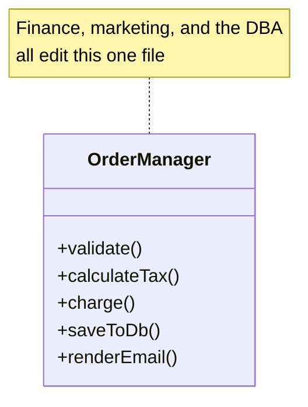
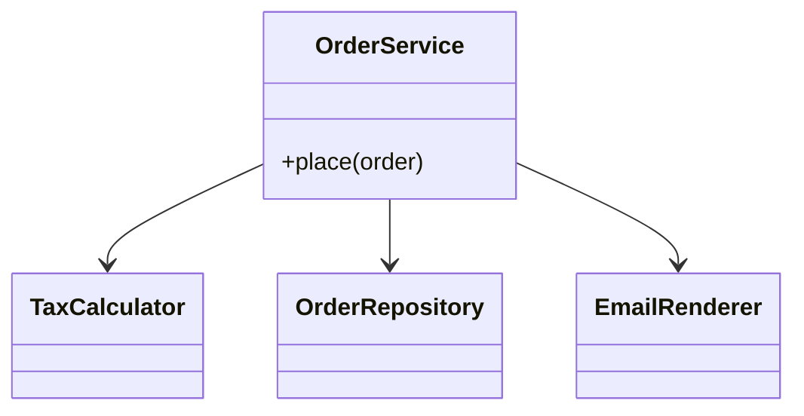
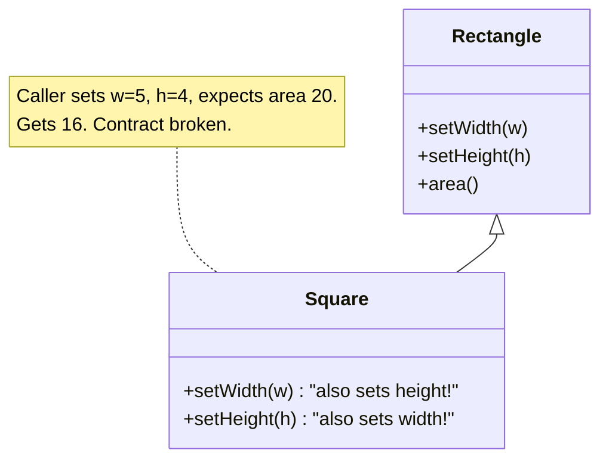
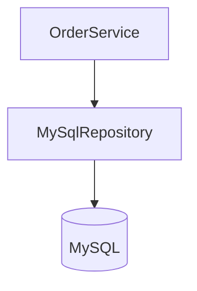
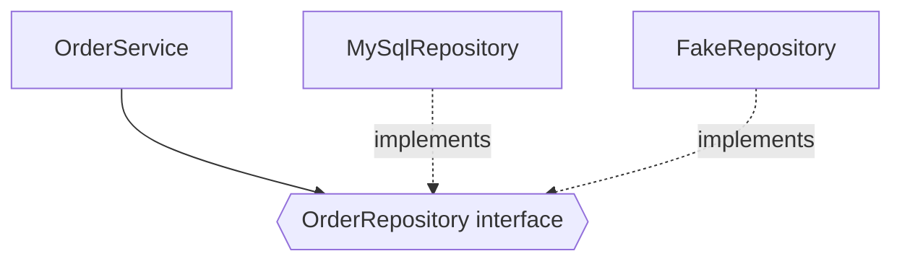

The first codebase I inherited had a class called `OrderManager` that did everything an order could possibly touch: it validated the cart, calculated tax, charged the card, wrote the row to Postgres, rendered the confirmation email, and logged the whole thing to a file. Two thousand lines. Every feature request landed in that one file, which meant every merge conflicted with every other merge, and a change to the tax logic once broke email rendering because both read the same half-shared `total` field. Nobody wrote it that way on purpose. It just accreted, one reasonable-at-the-time addition at a time, until touching anything meant understanding everything.

SOLID is five principles that, taken together, are the antidote to exactly that class. They don't make code shorter or faster. They make change *local*, so that a new requirement touches one class instead of rippling through fifteen. That's the entire payoff, and it's the only lens worth judging them through: when the requirement changes, how much has to change with it.

Robert C. Martin laid these out in his 2000 paper "Design Principles and Design Patterns," and Michael Feathers later stacked the initials into the word SOLID, but each principle is older than the acronym. Here they are in one line each, then one section apiece with the failure it actually prevents.

| | Principle | One sentence |
|---|---|---|
| **S** | Single Responsibility | A class should have one reason to change. |
| **O** | Open/Closed | Open for extension, closed for modification, add behavior without editing what already works. |
| **L** | Liskov Substitution | A subtype must be usable anywhere its base type is, without the caller knowing. |
| **I** | Interface Segregation | No client should be forced to depend on methods it never calls. |
| **D** | Dependency Inversion | Depend on abstractions, not concretions, and let both sides point at the interface. |

## Single Responsibility (S)

The one that's most quoted and most misread. "One responsibility" doesn't mean "one method" or "does one small thing." Martin's own sharper phrasing: a class should have **one reason to change**, which really means it should answer to **one actor**, one stakeholder who can ask for it to be different.

My `OrderManager` failed this five times over. Tax rules change when finance changes them. The email template changes when marketing changes it. The persistence code changes when the DBA migrates a column. Three different people, three different release cadences, all forced into the same file, all stepping on each other. That's the tell: if two unrelated stakeholders can each independently demand a change to the same class, it's doing two jobs.

### Without the principle



Every actor's change hits one class. The tax edit and the email edit collide in the same merge, and a shared `total` field lets one silently corrupt the other.

### With the principle

Split by actor. `TaxCalculator` answers to finance, `OrderRepository` to the DBA, `EmailRenderer` to marketing, and an `OrderService` orchestrates them without owning any of their logic.



Now a tax-rate change is one file the finance team owns, and it cannot break email rendering because email rendering is nowhere near it. The cost is more classes and one more layer to trace through, which is real, don't shatter a genuinely-single-purpose class into ceremony just to hit a rule. Split it when two different people would ask for two different changes, not before.

## Open/Closed (O)

Software should be **open for extension but closed for modification**: you add new behavior by adding new code, not by editing code that already works and already passed its tests. The reason isn't purity, it's blast radius. Every time you reopen a tested, shipping class to bolt on a case, you risk breaking the cases already in production.

The classic smell is a growing `if`/`else` or `switch` on a type tag. Every new variant means another branch inside the same method, so the file that handles payments gets edited every single time a new payment method ships.

### Without the principle

```java
double fee(Payment p) {
    if (p.type == CREDIT)  return p.amount * 0.03;
    else if (p.type == UPI)   return 0;
    else if (p.type == WALLET) return p.amount * 0.01;
    // add PayLater? edit this method again, re-test every branch above
}
```

Adding "PayLater" forces you back into a method that already correctly handles three cases, and now all four ship or none do.

### With the principle

Pull the varying thing behind an interface. Each payment method owns its own fee. A new method is a new class, the dispatcher never changes.

```java
interface Payment { double fee(); }
class Credit implements Payment { public double fee() { return amount * 0.03; } }
class Upi    implements Payment { public double fee() { return 0; } }
// PayLater? new class. Nothing above gets touched or re-tested.
```

This is the principle behind Strategy, Factory, and most of the plugin architectures you'll ever meet. The honest caveat: you can't make a class open to *every* axis of change, and trying to leaves you with speculative abstraction nobody uses. Leave it concrete until the second variant shows up, then abstract along the axis that actually varied. The first duplicate is data, the third is a pattern.

## Liskov Substitution (L)

Named for Barbara Liskov: if `S` is a subtype of `T`, you must be able to hand an `S` to any code expecting a `T` and have it still be correct, without that code knowing or caring which it got. Inheritance isn't "shares some fields," it's a promise that the subclass honors the base class's contract. Break the promise and every polymorphic call site becomes a landmine.

The textbook trap is real because it's subtle: a `Square extends Rectangle` looks airtight, a square *is a* rectangle in geometry class. But `Rectangle` implies `setWidth` and `setHeight` are independent. `Square` can't honor that, setting width has to change height too, so code written against `Rectangle` that sets width to 5, height to 4, and asserts area is 20 gets 16 from a Square. The subtype quietly violated an invariant the caller was relying on.



The practical tells that a subtype is lying about its parent: it overrides a method to throw `UnsupportedOperationException`, it strengthens a precondition (demands more than the base did), or it weakens a postcondition (promises less). A read-only list that `extends` a mutable one and throws on `add` is the everyday version, every caller that expected to mutate now crashes on a type it was told it could trust. When the "is-a" relationship doesn't survive contact with the base class's contract, don't inherit, model the difference explicitly instead (a `Shape` interface both implement, no false parent).

## Interface Segregation (I)

No client should be **forced to depend on methods it doesn't use**. Fat interfaces couple unrelated clients together: the moment one interface declares ten methods, every implementer owes all ten, and every change to any of the ten recompiles and re-reasons about all of them.

The giveaway is an implementation full of empty bodies or thrown exceptions, that's the class shouting that the interface asked it for things it has no business providing.

### Without the principle

```java
interface Worker { void work(); void eat(); void sleep(); }

class Robot implements Worker {
    public void work()  { /* real */ }
    public void eat()   { throw new UnsupportedOperationException(); } // robots don't eat
    public void sleep() { throw new UnsupportedOperationException(); }
}
```

`Robot` is dragged into `eat` and `sleep` because they happened to share an interface with humans. Notice this is also how you *get* Liskov violations, a fat interface almost forces some implementer to lie.

### With the principle

Split the fat interface into role-sized pieces, and let each class implement only the roles it actually fills.

```java
interface Workable { void work(); }
interface Feedable { void eat(); }

class Robot  implements Workable {}
class Human  implements Workable, Feedable {}
```

Small, purpose-named interfaces (`Readable`, `Closeable`, `Comparable`) are this principle in the standard library. The tension to watch: shattered too far and you get interface confetti, a dozen single-method interfaces nobody can assemble into a mental model. Group by the role a client actually plays, one interface per coherent set of things a caller needs together, not one per method and not one per everything.

## Dependency Inversion (D)

Two halves. **High-level modules should not depend on low-level modules, both should depend on abstractions.** And **abstractions should not depend on details, details should depend on abstractions.** The "inversion" is that the arrow flips: normally your business logic would reach down and `new MySqlOrderRepository()`, hard-wiring policy to a specific mechanism. Instead, the business logic declares the interface it needs, and the concrete database implements *that*, so both point at the abstraction in the middle.

### Without the principle



`OrderService` names `MySqlRepository` directly. Swap to Postgres and you edit the service. Unit-test it and you need a real MySQL, because there's no seam to slip a fake into.

### With the principle



`OrderService` depends only on the `OrderRepository` interface, and something on the outside decides which implementation to inject. Now the database is swappable without touching business logic, and a test drops in an in-memory fake through the same seam. This is what Dependency *Injection* frameworks mechanize, but the injection is just plumbing, the inversion is the principle, and you get it for free just by passing the interface into the constructor.

The realistic limit: not everything needs an interface. A one-liner value type or a pure function that will never have a second implementation doesn't earn an abstraction, and wrapping it in one is just indirection tax. Invert the dependencies you expect to swap, mock, or vary, which in practice means the ones that cross a boundary, the database, the network, the clock, the third-party API.

## How the five interlock

They aren't five separate rules so much as five angles on one idea: **isolate what changes so a change stays local.**

- **SRP** decides *where the seams go*, one per actor.
- **OCP** is the *goal*, extend without editing, and the other four are how you reach it.
- **DIP** puts an *interface* on the seam so the two sides move independently.
- **ISP** keeps that interface *the right size* so clients aren't dragged along by methods they don't call.
- **LSP** keeps every implementation behind the interface *honest*, so swapping one for another can't surprise the caller.

Break one and the others start failing in sympathy: a fat interface (ISP) forces some class to fake methods, which breaks substitutability (LSP), and the whole reason you wanted the abstraction (DIP, for OCP) quietly stops holding.

## In the interview

Nobody asks "explain SOLID" and then scores you on reciting the acronym, that's a warm-up, not the question. What actually happens: you're mid-way through designing a [Parking Lot](/interview/low-level-design/problems/parking-lot) or a [Splitwise](/interview/low-level-design/problems/splitwise), and the interviewer says *"now we also need to support X."* SOLID is the vocabulary you use to answer that without redrawing the whole board. The signal they're grading is whether your design absorbs the new requirement in one new class or forces you to reopen five.

**How to invoke each one out loud**, the sentence that shows you're using it deliberately:

- **SRP**: *"I'll pull fee calculation out of `ParkingLot` into its own `FeeCalculator`, because pricing rules change on a different schedule than the lot's slot tracking."* You're naming the *actor*, not just splitting for neatness.
- **OCP**: *"I'll put fee strategies behind a `FeeStrategy` interface so hourly, flat, and weekend pricing are each a class, adding a new one never touches the existing three."* This is where you casually reach for [Strategy](/interview/low-level-design/design-patterns/strategy).
- **LSP**: *"Every `ParkingSpot` subtype has to honor `canFit(vehicle)` the same way, if `CompactSpot` throws on a truck instead of returning false, every caller that trusted the base contract breaks."* Say this the moment you're tempted to inherit.
- **ISP**: *"I won't make `FreeParkingLot` implement a `Payable` it can't honor, I'll split `ParkingLot` from `Payment` so a free lot only depends on what it uses."* The tell you're avoiding is an implementation full of empty or throwing methods.
- **DIP**: *"`ParkingLotService` depends on a `PaymentGateway` interface, the Stripe or cash implementation gets injected, so I can unit-test the flow against a fake without a real gateway."* This is your answer to "how would you test this?"

**The red flags an interviewer is listening for**, and the SOLID name each one maps to:

| You said / drew… | They hear |
|---|---|
| a class with "and" in its job ("handles orders **and** emails") | SRP miss |
| "I'd add another `else if` here" | OCP miss |
| a subclass throwing `UnsupportedOperationException` | LSP miss |
| an interface with methods some implementers stub out | ISP miss |
| `new ConcreteThing()` inside business logic | DIP miss |

One caveat worth saying yourself before they catch you: **don't over-apply it live.** If you wrap a two-line value object in an interface "to be SOLID," a good interviewer reads that as cargo-culting, not judgment. The strong move is to build it concrete, then say *"if we needed a second pricing rule I'd pull this behind a `FeeStrategy`, but for one rule that's premature."* Knowing when *not* to abstract scores higher than reciting all five.

## The takeaway

SOLID is not a checklist to satisfy up front, and applied too eagerly it produces exactly the over-abstracted, interface-per-class sprawl it was meant to prevent. The one question that carries all five: *when this requirement changes, how many files do I edit?* If the answer keeps being "one," you're following SOLID whether you can recite the acronym or not. If it's "I'm not sure, let me trace it," one of these five is telling you where the seam should have been. Wait for the second variant, then put the seam exactly where the change landed.

[← Back to Low Level Design](/interview/low-level-design)
